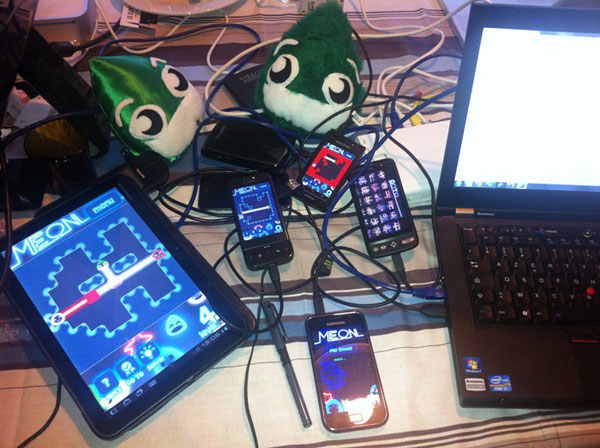

## Manboula v4

This was the fourth international edition of __Manboula__®, our own internal coding party!

### At the menu

- a lot of Apple TV bashing,
- some [intellectual movies](http://www.imdb.com/title/tt0978764/),
- beach walks,
- beer talks,
- MySQL recompilation (a Manboula isn't a truly Manboula without it's own MySQL recompilation),
- no showers,
- and, of course, a few programming...

### Some pictures

Yes, this is [Meon](http://itunes.apple.com/us/app/meon/id400274934?mt=8) on a Xoom!

View from the window beside our desk, in our office (maybe one day):

 
So guys, when will happens the v5? 

From jc.

