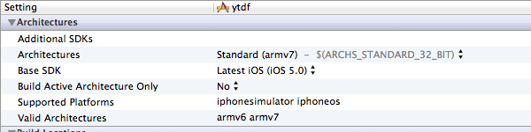
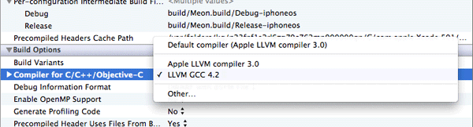

## Xcode 4.2 is not armv6 Best Friend

__Updated on 2012/02/21:__ Apple has released Xcode 4.3 since a few days and has updated Apple LLVM compiler to 3.1. This version solves the `armv6` issue, and now I can compile using Apple LLVM even for 3G iPhones. Finally, I'll be able to use `ARC`! 

* * * * *

### armv7 for all

Xcode 4.2 doesn't like `armv6` (ie pre 3GS devices), it's a fact.
 
The first proof of it is when you create a new project from Xcode templates (Empty Application project for instance), the code skeletton will only support `armv7` device. It does even _require it_: open `Info.plist`, and check the `UIRequiredDeviceCapabilities` key. You will find the `armv7` capability, that will prevent your app to be downloaded on, let's say, a 3G iPhone. On iTunes, this capability is also used, among other settings, to display the list of compatible devices supported by your app: Meon 1.3 is listed as “Compatible with iPhone, iPod touch, and iPad. Requires iOS 3.0 or later”... 

If you don't want to target iPhone 3G that's fine. But if you want to continue supporting your 3.x iPhone 3G customers, this is a problem. In this case, best practices are to set the `BASE_SDK` to Latest and set the `DEPOYMENT_TARGET` to 3.x (Go to Project -> Build Settings and look for iOS Deployment target). Doing this, you app will link against the latest SDK, your iOS 5 customers will be able to use the shiny new iOS 5 features (Hello iCloud, Newsstand), and your iOS 3.x customers will be able to download your app. Provided you've removed the `armv7` `UIRequiredDeviceCapabilities`, and you've checked that no code path requiring iOS > 3.x is hitten by your 3.x client, everything should be OK. 

Except, that Xcode 4.2 have, again, bring some modifications. 

If you go to Project -> Build Settings and looks for Architectures, you will see the constant `$(ARCHS_STANDARD_32_BIT)`. 

Beginning with Xcode 4.2, this constant evals to `armv7` while in previous version it was equal to `armv6`! Xcode really doesn't like `armv6`; by default, it compiles only the `armv7` flavour of your code, and your app binary literally doesn't support `armv6` (that's why there is a `armv7` capability by the way). If you want to target `armv6` devices, you must change Architectures from `$(ARCHS_STANDARD_32_BIT)` to `armv6` and `armv7`. If you don't do this, you won't be able to submit your application to the App Store. At the validate stage, the link will fail with this error:

	warning: iPhone/iPod Touch: application executable is missing a required architecture.
	At least one of the following architecture(s) must be present: armv6 (-19033)

A side note, Architectures and Build Active Architectures Only are two different settings and you should set the latter to NO, in Debug and in Release.

### Sneaky Clang

So, now, you've remove `armv7` `UIRequiredDeviceCapabilities`, you have force the compiler to build for `armv6` and `armv7` architectures, you app builds fine and the pre-validation tool doesn't complain anymore, everything is cool.

That's basically what I've followed when I've upgraded the Meon xcodeproj for developping with Xcode 4.2. But there was one more thing... 

I've tried Meon on a real 3G device.

While the previous version of Meon runs fine on a old device, this version has suddenly became sluggish, with strange bugs that I've never seen before, `CALayer` alignment and hitting problem, and most important perfomances problem.

Some searches with in the official [Apple forum](https://devforums.apple.com/community/ios) [^1] [^2], and also, of course, in [Stackoverflow](http://stackoverflow.com/) [^3] [^4] points issues with Apple LLVM 3.0 new compiler (codename Clang) and `armv6`. It seems that the Clang front-end parser has issues with certain data structures (`CGPoint`, `CGRect`...) and can produce buggy `armv6` code generation and optimizations. If your code is dealing with `CALayer` and/or `CoreAnimation`, you can have some troubles on 3G devices. The sneaky part is that you may not see it if you've compile in Debug, where most optimizations are disable.

One possible solution is to add the `-mno-thumb` to your project, or to simply use the other possible compiler LLVM GCC 4.2. 

On the Apple forum, these issues seem to be corrected with the last updated Xcode 4.2.1. For Meon, the build with Xcode 4.2.1 and Apple LLVM 3.0 is still buggy on a 3G. I don't know why, something is maybe broken in the xcodeproj, but, if I compile with LLVM GCC 4.2, everything is OK on an `armv6` device. For now, I'm staying with GCC... until the next Xcode update ^_^...

From jc.

[^1]: [https://devforums.apple.com/thread/122059](https://devforums.apple.com/thread/122059)
[^2]: [https://devforums.apple.com/message/542108](https://devforums.apple.com/message/542108)
[^3]: [http://stackoverflow.com/questions/7488657/how-to-build-for-armv6-and-armv7-architectures-with-ios-5](http://stackoverflow.com/questions/7488657/how-to-build-for-armv6-and-armv7-architectures-with-ios-5)
[^4]: [http://stackoverflow.com/questions/8391307/coordinates-all-wrong-on-iphone-3g-it-could-be-your-compiler](http://stackoverflow.com/questions/8391307/coordinates-all-wrong-on-iphone-3g-it-could-be-your-compiler)

