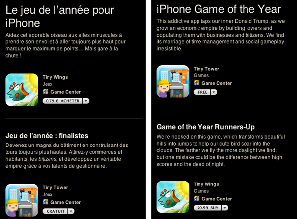

## Tiny Games of the Year

<iframe width="480" height="360" src="http://www.youtube.com/embed/x6pT_2E5xI0" frameborder="0" allowfullscreen align="middle"></iframe>

[Tiny Wings](http://itunes.apple.com/app/tiny-wings/id417817520?mt=8) has been selected by Apple as [the iPhone Game of 2011](http://itunes.apple.com/WebObjects/MZStore.woa/wa/viewFeature?id=480278091).

Tiny Wings is a really good game, addictive as hell, with a superb music, some procedural graphics, a perfect touchscreen gameplay. It's a _hardcore casual game_:  a game that you can launch and play in a matter of seconds, but you will need a lot of time to master it. My personal record is island 9, and I've got a hard time to reach it! The more you play, the better you are.

What's surprising is that Tiny Wings is a creation of one man, [Andreas Illiger](http://www.andreasilliger.com), so it's proof that there is room for original and successful indie games on the App Store.

A side note, while Tiny Wings is selected as the iPhone Game of the Year on the French App Store, it's only a runner-up on the US app store. On the US app store, the best game is Tiny Tower; also a very good game but not as original as Tiny Wings. Not sure why the selection is different on the two stores, maybe the download numbers influenced this choice. Anyway, you has to be a _Tiny_ if you wanted to be one of the best games!

Tiny Wings rules! Don't hesitate to download it.

From jc.
