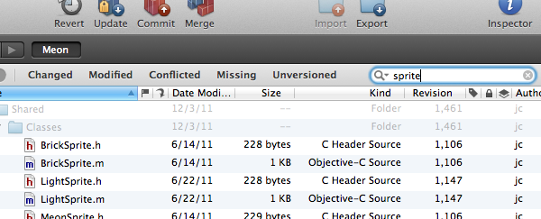
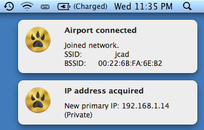
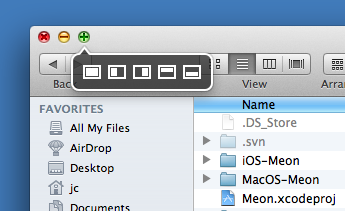
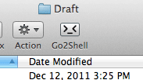

## My Daily MacOS Apps

### Development

- __[BBEdit](http://itunes.apple.com/app/bbedit/id404009241?mt=12)__: my text and code editor for anything else that is not Objective-C (mainly Markdown, PHP, shell and I wish Ruby ;) ). Some may prefer 
[TextMate](http://macromates.com/), with an awaited version 2, but I haven't tried it. BBEdit is really powerfull, and you'll need some times to master all features. Simple, performant and Lion-optimized, the more I use it, the more I enjoy.

- __[Cornerstone](http://itunes.apple.com/app/cornerstone/id404789253?mt=12)__: the best graphical user interface for Subversion. I used [Versions](http://versionsapp.com/) until very recently but I've switched to Cornerstone. Cornerstone has a better UI, an integrated diff viewer, and some useful features like files filters etc..  <small class="caption">Cornerstone filter text field on the working directory</small> At Manbolo, we use Subversion a lot; maybe some days we'll switch to Git but until that day, I will use Cornerstone/Subversion combo (and the command line if I'm threatened).

- __[Xcode](http://itunes.apple.com/app/xcode/id448457090?mt=12)__: I use it for all iOS development. Version 4 is very good, while there are still [some bugs](http://blog.manbolo.com/2011/12/04/xcode-4.2-is-not-armv6-best-friend). I have only one big complaint: Xcode has become __slower and slower__ since last v3. Windows can take too long times to appears, the IDE need serious optimizations, sometimes you have the impression that Xcode is stuck and you don't know why. I can live with small bugs, but for now the interface is too heavy and slow, and make my MacBook Pro 2008 feel too old! That said, if you do a lot of Objective-C, you _have to_ buy the followings companion apps: Accessorizer and Snippets.

- [__Accessorizer__](http://itunes.apple.com/us/app/accessorizer/id402866670?mt=12): helper to quickly generate code like properties declaration, dealloc implementation etc... Maybe with `ARC` and compiler property generation, Accessorizer becomes less relevant but in many situations it can save you _a lot of times_, writing glue code. Definitively Must-have if you are an iOS/MacOS dev.

- __[Snippets](http://www.snippetsapp.com)__: used to host small code snippets, lines of code that you reuse every time. Very simple and ergonomic, I use it mainly for Objective-C but can be used with many many languages (or for other usage like frequent mail support etc...)

- __[MAMP](http://www.mamp.info/en/index.html)__: easy Apache-MySQL-PHP stack installation on your Mac. Really useful for local web development and tests.

- [__Changes__](http://connectedflow.com/changes/): diff viewer, useful to compare, merge files or entire folders. Certainly not the best diff tool but does the job. I haven't tried any other apps yet ([Araxis Merge](http://www.araxis.com/merge_mac/Download.html) could be a potential winner), my only complain about Changes is its average performances.

- [__HTTP Scoop__](http://www.tuffcode.com/): simple, native, fast and super easy-to-use HTTP sniffer. It works great with any browser and also with the iOS simulator, so you can easily debug your RESTful iPhone app. It is not as powerful as its granddaddy [Wireshark](http://www.wireshark.org/) but, at least, it loads instantaneously, is ready to record in less than a second and the UI doesn't show an ugly X11 window.

### Utilities you can't live without

- __[Growl](http://itunes.apple.com/app/growl/id467939042?mt=12)__ and __[HardwareGrowler](http://itunes.apple.com/app/hardwaregrowler/id475260933?mt=12)__: <small class="caption">Growl can notify you each time you're connected to a new Wi-Fi hotspot</small> Send overlay notifications from many apps (like Cornestone for instance). HardwareGrowler notifies you of all hardware notifications, like IP address renewal, USB disk insertion etc.. I use Growl also in my shell scripts to notify me of start/stop event. V1.3 had some issues with Lion but is now stable enough.

- __[Dropbox](http://dropbox.com)__: de-facto standard to share files between different devices. I use it to write draft blog posts on my iPad and continue to my MacBook. Completely and seamlessly integrated in the Finder.

- __[Moom](http://itunes.apple.com/app/moom/id419330170?mt=12)__: very small and lightweight windows manager.  <small class="caption">Moom adds a small overlay menu over each window maximize button</small> I use it, for instance, to have two adjacent Finder windows. Keyboard shortcuts can be assigned to each function.   

- __[Clean](http://itunes.apple.com/app/clean/id418412301?mt=12)__: automatically clean your Desktop every day. Items are not deleted but moved to a chosen directory (~/Documents/Desktop by default); labeled items stay on your Desktop. Perfect for the laziest like me.

- __[Go2Shell](http://itunes.apple.com/fr/app/go2shell/id445770608?mt=12)__: open a Terminal window located in the current Finder directory. Simply integrated in the Finder toolbar, time saver.

### Graphics & video

- [__Photoshop__](http://www.adobe.com/products/photoshop.html): I actually use 2% of all Photoshop's features but I use this 2% a lot! I own the CS3 version now, the performances are good but could be certainly better. I probably will try a cheaper, Lion-features optimized (and maybe less slow) alternative some days, like [Acorn](http://itunes.apple.com/app/acorn-the-image-editor-for/id402280036?mt=12) or [Pixelmator](http://itunes.apple.com/app/pixelmator/id407963104?mt=12). If you use sometimes Photoshop, try to learn some keyboards shortcuts.

- __[OmniGraffle](http://itunes.apple.com/fr/app/omnigraffle/id404458553?mt=12)__: the perfect tool for diagram, schemes, or app mockups/storyboard. The killer feature is the [Graffletopia](http://graffletopia.com/): a free online library of Omnigraphle resources like hand-drawn iPhone shape or electric circuit. Really worth the price.

- __[Suitcase Fusion](http://www.extensis.com/en/products/suitcasefusion3/overview.jsp)__: if you have many fonts on your system, Suitcase can help you to dynamically load/unload fonts and have your menus not clustered. I use v2 for the moment and have no need to upgrade to v3.

- __[ScreenFlow](http://itunes.apple.com/app/screenflow/id422025166?mt=12)__: we use it for video screen capture. With the iOS Simulator, you can do a promotional video of your app very simply.

- __[VLC](http://www.videolan.org/vlc/)__: Video player which can read practically every video file format (avi, ogg etc...). Who hasn't VLC installed on its computer?

### Miscellaneous

- __[AppZapper](http://appzapper.com/)__ the uninstaller Apple forgot! If you don't like that preferences or other files stay on your system when you trash (ie uninstall) an app, give AppZapper a try.

- [__AppViz__](http://www.ideaswarm.com/AppViz2.html): download and make a dashboard of your Apple sales. Simple and ergonomic, can be also used to quickly check and download your app reviews, on every country. Quicker and simpler than connecting to iTunesConnect. Multi-accounts is supported.

- [__Chrome__](http://www.google.com/mac/): probably the app I use the most! I've tried Safari but every time come back to Chrome, mainly for its unified URL/search bar. If Safari adopts this multi-purpose single bar, I will try to switch, to benefit Safari's Reader feature. With Chrome, it's very uncertain that Google adds a Reader feature to remove all ads cluster, so I use the Readability plugin.

- __[Dino Run SE](http://itunes.apple.com/app/dino-run-se/id426805840?mt=12)__: Must-have. No-brainer. Can't wait for the iOS version.

From jc.
