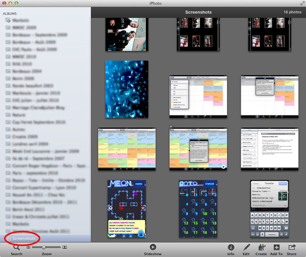

## Remove iPhone Screen Captures from iPhoto

If you develop on iOS, you've certainly captured a lot of screenshots on your iPhone. Unfortunately, if your iPhone is sync with iPhoto, all these screen captures are cluttering your photos Library. I've wrote, with Olivier([@_oho](https://twitter.com/_oho))'s help,  a small AppleScript script that creates an iPhoto album called "Screenshots" and that allows you to delete these screenshots. 

	tell application "iPhoto"
		
		if exists album "Screenshots" then remove album "Screenshots"
		new album name "Screenshots"
		add (every photo whose ((dimensions = {768, 1024} or dimensions = {1024, 768} or dimensions = {320, 480} or dimensions = {480, 320} or dimensions = {640, 960} or dimensions = {960, 640}) and image filename contains "PNG")) to album "Screenshots"
		
	end tell	
	
With Automator, making an iPhoto service from this AppleScript [is really easy](http://arstechnica.com/apple/guides/2011/03/howto-build-mac-os-x-services-with-automator-and-shell-scripting.ars). I've created a workflow, that you can download [SelectScreenshots.workflow.zip](SelectScreenshots.workflow.zip). Just uncompress it and copy it to /Users/{your\_user}/Library/Services. Now, you can launch iPhoto and access to this service in iPhoto > Services > Select Screenshots. When you launch it, a Screenshots album will be created, that will contains all iPhone and iPad screen captures. 

<small class="caption">Launches the "Select Screenshots" service creates a "Screenshots" album</small>

If you want to remove a screenshot from the entire library, all you have to do is:

1. Select the photo in the Screenshots album
2. Hold down Command &#8984; and Option &#8997;, then press Delete.

If you don't do this, and simply delete picture, it _won't be removed from your photo library_, just from the Screenshots album. 

From jc.

