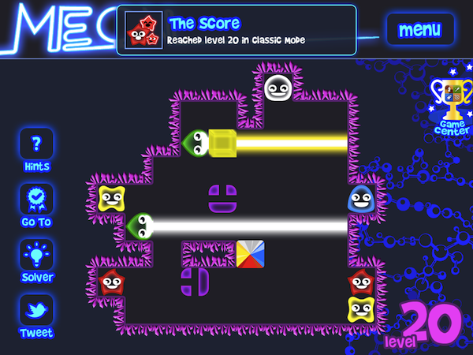

## Coming Soon: Meon on iPad (and universal!)

Some App Store comments:

> __Very funny game__, by Jobar-01 -  Aug 2, 2011:
> excellent game, when for Ipad?

> __Sympa__, by Delimited - Aug 4, 2011:
> Sympa, mais manque une version universelle pour iPad, sur grand écran, ça
> déchire, lol

> __Un must__, by Stenngrard - Aug 19, 2011:
> Brillantissime! Un bon moyen pour se plonger un peu plus dans l'Ipad si on
> aime se triturer les méninges.

Well, we have some news for you...

Current work in progress: the next version of Meon, aka Meon 1.4, will be available on iPad as an _universal app_: if you have bought the iPhone version, you'll have the iPad optimized version for free!

We also plan to integrate iCloud to save your progression: you will be able to unlock levels on your iPhone in the bus, and, once at home, take your iPad to continue playing!

From jc. 