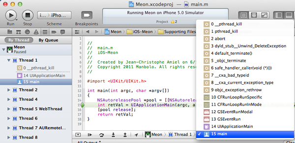
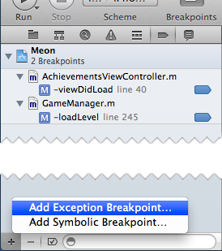
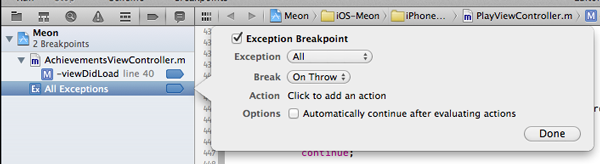
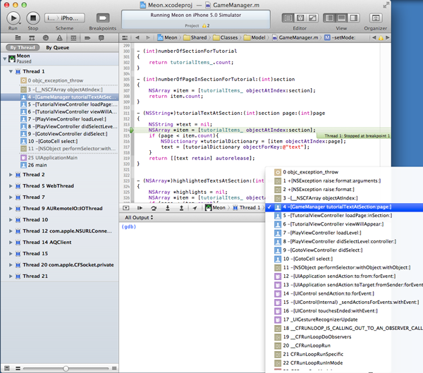

## Xcode Tips #1 - Break on Exceptions

This quick tip will save you a lot of debugging time!

Sometimes, you have a crash and your call stack looks like:

Well, this callstack doesn't tell you a lot, apart that your app has crashed _somewhere_. In the `gdb` console, the last message is: 

	*** Terminating app due to uncaught exception 'NSRangeException', reason:
	'-[__NSCFArray objectAtIndex:]: index (28) beyond bounds (7)

The log is also not very useful, except that you know you have an array overrun. Actually, the default behavior of Xcode is to stop where the exception is caught, not where the exception is raised! This is not very useful but fortunately, Xcode can stop as soon as the exception is raised [^1][^2].

In your project, go to the Breakpoint navigator, click on the '+' button and 'Add Exception Breakpoint...' 

Click on 'Exception>All' and 'Break>On Throw' and 'Done'. 

Now, Xcode will break each time a new exception is raised! As you can see in my project, Xcode breaks on the very exact line that has caused an array overrun. 

<small class="caption">Mmm... Something is bad in this tutorialItems_ array!</small>

The only caveat is that you've to do this for each of your project! 

From jc.

[^1]: [http://alwaysthecritic.typepad.com/atc/2009/06/iphone-app-debugging-stop-on-exception.html](http://alwaysthecritic.typepad.com/atc/2009/06/iphone-app-debugging-stop-on-exception.html)
[^2]: [http://stackoverflow.com/questions/4961770/run-stop-on-objective-c-exception-in-xcode-4](http://stackoverflow.com/questions/4961770/run-stop-on-objective-c-exception-in-xcode-4)
