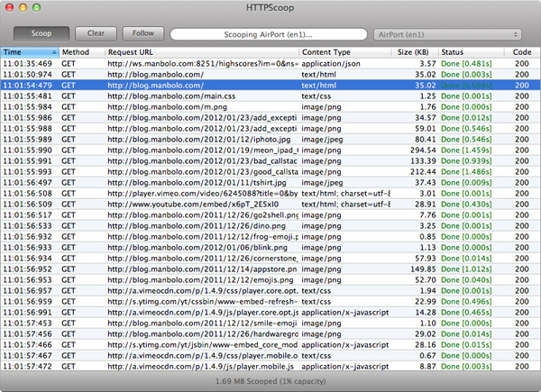

## HTTP Scoop: a Simple and Efficient HTTP Sniffer for MacOS

[HTTP Scoop](http://www.tuffcode.com/) is a simple, native, fast and super easy-to-use HTTP sniffer for MacOS. It works great with any browser and also with the iOS simulator, so you can easily debug your RESTful iPhone app. It is not as powerful as its granddaddy [Wireshark](http://www.wireshark.org/) but, at least, it loads instantaneously, is ready to record in less than a second and the UI doesn't show an ugly X11 window. Important to know, it scans only the port 80 by default; you have to add other ports in the preferences.

Worth the 12€.

From jc.