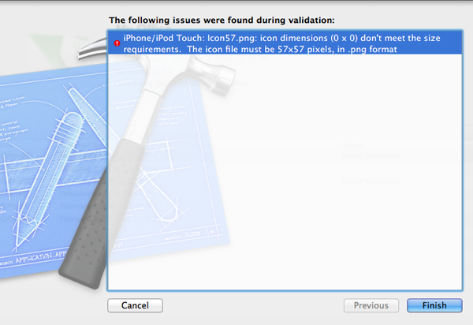

## MacOSX 10.7.3 Update Breaks iOS App Validation

The last update of Lion (aka 10.7.3), available since yesterday, breaks iOS icon validation. With this update, you won't be able to validate, nor submit your app through Xcode and also through Application Loader. In fact, you won't be able to submit an app to the App Store.

If during the build of your app, or while trying to submit you app, you encouter this problem:

	iPhone/iPod Touch: Icon.png: icon dimensions (0 x 0) don't meet the size requirements. The icon file must be 57x57 pixels, in .png format (-19014)
	
Don't panic.

The workaround, as described on [the Apple iOS forum](https://devforums.apple.com/message/611733), is to download the [last version of Application Loader](https://itunesconnect.apple.com/apploader/ApplicationLoader_2.5.1.dmg). Once you've downloaded it, launch Application Loader, check that the version is  `2.5.1 (235)`. Relaunch your Xcode project, Clean and Archive. The icon validation warning should have gone and you are able to submit apps again.

From jc.   

