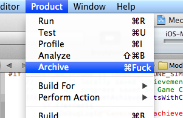
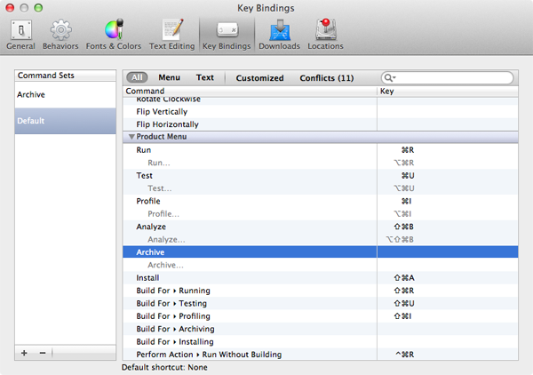

## Xcode 4 Keyboard Shorcut for Archive

If you're searching for an 'Archive' keyboard shortcut in Xcode 4... Well, you're not in the right place. Like you, I'm still trying to figure how to assign a keyboard shortcut to this command.

In Xcode 4, the whole shortcuts have been revamp, and they feel more consistant:

- Run: &#8984;R - Build for Running: &#8679;&#8984;R - Run Without Building: &#8963;&#8984;R
- Test: &#8984;U - Build for Testing: &#8679;&#8984;U - Test Without Building: &#8963;&#8984;U
- Profile: &#8984;I - Build for Profiling: &#8679;&#8984;I - Profile Without Building: &#8963;&#8984;I
- Archive: __(void)__- Build for Archiving: __(void)__ - Archive Without Building: __(void)__

As you can see, there is no built-in keyboard shortcut for archive. You _have to use your mouse_ each time you want to archive an app. There is certainly some very clever design decision not to assign a keyboard shortcut to 'Archive' but I can't think of one. Even 'Edit Scheme' deserves its own shortcut (&#8984;<), but how often do you need to use 'Edit Scheme', compare to 'Archive'??

### Possible solution 1: assign a shortcut
	
Why not try to change some keyboard shortcuts in Xcode preferences? Sure, 
Go to 'Preferences... > Key Bindings'. 

Hmmm, there is an 'Archive (Product Menu)', with no shortcut. Now, I just have to find a simple mnemonic shortcut to assign to Archive. &#8679;&#8984;A (currently assigned to 'Install') seems a good candidate. I've no idea what stand 'Install' for, I don't use it so I will simply deassign &#8679;&#8984;A from 'Install' and assign it to 'Archive'. The problem is... Xcode 4.3 crashes each time I try to assign any shortcut to Archive! Xcode!!! Nooooooo.....

### Possible solution 2: create a shell script based service to archive 

You can easily archive your project in command line. From your source repository, just run:

	xcodebuild -scheme MyApp archive
	
Provided you have a scheme named MyApp (that's probably the case if you've a MyApp target), you will see new archives in the Organizer window. Given this, you could create an Xcode service that will launch this script. The problem of this solution is that the output of the compilation will not be visible in your IDE, but in a terminal window. This is suitable for continuous integration, but not for episodic archiving within the IDE.

### Possible solution 3: pray

I hope Apple will add a default shortcut for Archive, or will fix the Key Bindings in the next Xcode updates. Xcode 4.3 has serious issues ([just look at the last entries on Apple Xcode 4 forum](https://devforums.apple.com/community/xcode4)), and mine is minor so I've filled a [rdar://10926699](http://openradar.appspot.com/10926699) and will pray.

From jc.

