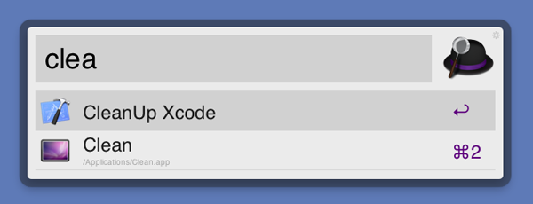

## Clean Up Xcode with Alfred

From [Mugunth Kumar](http://blog.mugunthkumar.com/), [a small script for cleaning up Xcode](http://blog.mugunthkumar.com/coding/panacea-for-slow-xcode/) when it becomes too slow... 

	rm -r ~/Library/Application\ Support/iPhone\ Simulator/5.1/Applications
	mkdir ~/Library/Application\ Support/iPhone\ Simulator/5.1/Applications
	rm -r ~/Library/Developer/Xcode/DerivedData 
	mkdir ~/Library/Developer/Xcode/DerivedData
	
In the [associated gist](https://gist.github.com/2289050), there is also a proposal to clean the older SDKs versions.

I've added a Growl notification to my script, and I will use it with __Alfred__. If you don't know yet Alfred, think of Spotlight on steroids. Buy the [free version on the Mac App Store](http://itunes.apple.com/fr/app/alfred/id405843582?mt=12), and the [£15 Powerpack on the Alfred web site](http://www.alfredapp.com/powerpack/), you won't regret it.

Speaking of Mugunth Kumar, don't miss the second part of his [RESTful series - Doing it the right way](http://blog.mugunthkumar.com/articles/restful-api-server-doing-it-the-right-way-part-2/).

From jc.   
