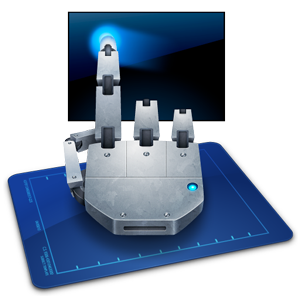
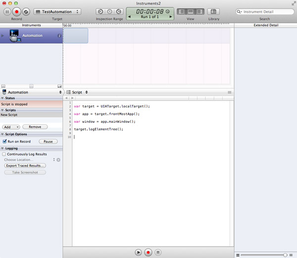

## iOS Automated Tests with UIAutomation

__Updated on 2013/04/08:__ Added command-line for Xcode >= 4.5, how to take screenshots and launch local scripts. 

* * * * *

### Quick introduction

Automated tests are very useful to test your app “while you sleep”. It enables you to quickly track regressions and performance issues, and also develop new features without worrying to break your app. 

Since iOS 4.0, Apple has released a framework called UIAutomation, which can be used to perform automated tests on real devices and on the iPhone Simulator. The documentation on UIAutomation is quite small and there is not a lot of resources on the web. This tutorial will show you how to integrate UIAutomation in your workflow.

The best pointers to begin are the [Apple documentation on UIAutomation](http://developer.apple.com/library/ios/#documentation/DeveloperTools/Reference/UIAutomationRef/_index.html), a very good quick tutorial in [Apple Instruments documentation](http://developer.apple.com/library/ios/#documentation/DeveloperTools/Conceptual/InstrumentsUserGuide/Built-InInstruments/Built-InInstruments.html#//apple_ref/doc/uid/TP40004652-CH6) and, of course, the slides/videos of  [WWDC 2010 - Session 306 - Automating User Interface Testing with Instruments](
http://developer.apple.com/devcenter/download.action?path=/wwdc_2010/wwdc_2010_video_assets__pdfs/306__automating_user_interface_testing_with_instruments.pdf). You'll need a free developper account to access this ressources.

Another framework to be mention is OCUnit, which is included in Xcode, and can be used to add unit tests to your app.

1.	[__Your first UIAutomation script__](#1)
	*	[Using iOS simulator](#1.1)
    *	[Using an iOS device](#1.2)
2.	[__Dealing with UIAElement and Accessibility__](#2)
    *	[UIAElement hierarchy](#2.1)
    *	[Simulate user interactions](#2.2)
3.	[__Tips to simplify your life__](#3)    
    *	[Introducing Tune-up](#3.1)
    *	[Import external scripts](#3.2)
    *	[By the power of the command line](#3.3)
    *	[Interactively record interaction](#3.4)
    *	[“When things don't work, add UIATarget.delay(1);”](#3.5)
4.	[__Advanced interactions__](#4)    
    *	[Handling unexpected and expected alerts](#4.1)
    *	[Multitasking](#4.2)
    *	[Orientation](#4.3)
    *	[Taking screenshot](#4.4)
    *	[Launching local script](#4.5)
5.	[__The end__](#5)    
    *	[Useful links](#5.1)
    *	[A video](#5.2)
    

* * *

<h3 id="1">1. Your first UIAutomation script</h3>

UIAutomation functional tests are written in Javascript. There is a strong relation between UIAutomation and accessibility, so you will use the accessibility labels and values to simulate and check the results of simulated UI interaction.

Let's go, and write our first test!

<h4 id="1.1">Using iOS simulator</h4>

1.	Download the companion project [TestAutomation.xcodeproj](http://blog.manbolo.com/2012/04/08/TestAutomation.zip), and open it. The project is a simple tab bar application with 2 tabs.
2.	Insure that the following scheme is selected 'TestAutomation > iPhone 5.0 Simulator' (Maybe you've already switched to 5.1 so it could be also iPhone 5.1)

3.	Launch Instruments (Product > Profile) or &#8984;I.
4.	In iOS Simulator, select the Automation template, then 'Profile' 
	
5.	Instruments is launching, and start recording immediately. Stop the record, (red button or &#8984;R).

6.	In the Scripts window , click 'Add > Create' to create a new script

7.	In the Script window editor, tap the following code

		var target = UIATarget.localTarget();
		var app = target.frontMostApp();
		var window = app.mainWindow();
		target.logElementTree();

8.	Re-launch the script &#8984;R (you don't need to save). The script runs and you can stop it after logs appear.

Voilà! You've written your first UIAutomation test! 

<h4 id="1.2">Using an iOS device</h4>

You can also run this test with a real device, instead of the simulator. Automated tests are only available on devices that support multitask: iPhone 3GS, iPad, running iOS > 4.0. UIAutomation is unfortunately not available on iPhone 3G, whatever is the OS version. 

To run the test on a device:

1.	Connect your iPhone to USB
2.	Select the scheme 'TestAutomation > iOS Device'
3.	Check that the Release configuration is associated with a Developper profile (and not an Ad-Hoc Distribution profile). By default, profiling is done in Release (there is no reason to profile an app in Debug!)

4.	Profile the app (&#8984;I)
5.	Follow the same steps than previously on the Simulator. 

* * *

<h3 id="2">2. Dealing with UIAElement and Accessibility</h3>

<h4 id="2.1">UIAElement hierarchy</h4>

There is a strong relationship between Accessibility and UIAutomation: if a control is accessible with Accessibility, you will be able to set/get value on it, produce action etc... A control that is not “visible” to Accessibility won't be accessible through automation. 

You can allow accessibility/automation on a control whether using Interface Builder, or by setting programmatically the property `isAccessibilityElement`. You have to pay some attention when __setting accessibility to container view__ (i.e. a view that contains other UIKit elements). Enable accessibility to an entire view can “hide” its subviews from accessibility/automation. For instance, in the project, the view outlet of the controller shouldn't be accessible, otherwise the sub controls won't be accessible. If you have any problem, `logElementTree` is your friend: it dumps all current visible elements that can be accessed.    
  
Each UIKit control that can be accessed can be represented by a Javascript Object, UIAElement. UIAElement has several properties, `name`, `value`, `elements`, `parent`. Your main window contains a lot of controls, which define a UIKit hierachy. To this UIKit hierarchy, corresponds an UIAElement hierachy. For instance, by calling `logElementTree` in the previous test, we have the following tree:

	+- UIATarget: name:iPhone Simulator rect:{{0,0},{320,480}}
	|  +- UIAApplication: name:TestAutomation rect:{{0,20},{320,460}}
	|  |  +- UIAWindow: rect:{{0,0},{320,480}}
	|  |  |  +- UIAStaticText: name:First View value:First View rect:{{54,52},{212,43}}
	|  |  |  +- UIATextField: name:User Text value:Tap Some Text Here ! rect:{{20,179},{280,31}}
	|  |  |  +- UIAStaticText: name:The text is: value:The text is: rect:{{20,231},{112,21}}
	|  |  |  +- UIAStaticText: value: rect:{{145,231},{155,21}}
	|  |  |  +- UIATabBar: rect:{{0,431},{320,49}}
	|  |  |  |  +- UIAImage: rect:{{0,431},{320,49}}
	|  |  |  |  +- UIAButton: name:First value:1 rect:{{2,432},{156,48}}
	|  |  |  |  +- UIAButton: name:Second rect:{{162,432},{156,48}}

To access the text field, you can just write:

	var textField = UIATarget.localTarget().frontMostApp().mainWindow().textFields()[0];

You can choose to access elements by a 0-based index or by element name. For instance, the previous text field could also be accessed like this:

	var textField = UIATarget.localTarget().frontMostApp().mainWindow().textFields()["User Text"];
	
The later version is clearer and should be preferred. You can set the name of a UIAElement either in Interface Builder:

or programmaticaly:

	myTextField.accessibilityEnabled = YES;
	myTextField.accessibilityLabel = @"User Text";

You can see now that accessibility properties are used by UIAutomation to target the different controls. That's very clever, because 1) there is only one framework to learn; 2) by writing your automated tests, you're also going to insure that your app is accessible! So, each UIAElement can access its children by calling the following functions: `buttons()`, `images()`, `scrollViews()`, `textFields()`, `webViews()`, `segmentedControls()`, `sliders()`, `staticTexts()`, `switches()`, `tabBar()`, `tableViews()`, `textViews()`, `toolbar()`, `toolbars()` etc... To access the first tab in the tab bar, you can write:

	var tabBar = UIATarget.localTarget().frontMostApp().tabBar();
	var tabButton = tabBar.buttons()["First"];	

The UIAElement hierarchy is really important and you're going to deal with it constantly. And remember, you can dump the hierarchy each time in your script by calling `logElementTree` on UIAApplication:

	UIATarget.localTarget().frontMostApp().logElementTree();

In the simulator, you can also activate the Accessibility Inspector. Launch the simulator, go to 'Settings > General > Accessibility > Accessibility Inspector' and set it to 'On'.

This little rainbow box is the Accessibility Inspector. When collapsed, Accessibility is off, and when expanded Accessibility is on. To activate/desactivate Accessibility, you just have to click on the arrow button. Now, go to our test app, launch it, and activate the Inspector.

Then, tap on the text field and check the `name` and `value` properties of the associated UIAElement (and also the NSObject `accessibilityLabel` and `accessibilityValue` equivalent properties). This Inspector will help you to debug and write your scripts. 

<h4 id="2.2">Simulate user interactions</h4>

Let's go further and simulate user interaction. To tap a button, you simply call `tap()` on this element:

	var tabBar = UIATarget.localTarget().frontMostApp().tabBar();
	var tabButton = tabBar.buttons()["First"];	
	
	// Tap the tab bar !
	tabButton.tap();
	
You can also call `doubleTap()`, `twoFingerTap()` on UIAButtons. If you don't want to target an element, but only interact on the screen at a specified coordinate screen, you can use:

-	Taps:

		UIATarget.localTarget().tap({x:100, y:200});
		UIATarget.localTarget().doubleTap({x:100, y:200});
		UIATarget.localTarget().twoFingerTap({x:100, y:200});

-	Pinches:

		UIATarget.localTarget().pinchOpenFromToForDuration({x:20, y:200},{x:300, y:200},2);
		UIATarget.localTarget().pinchCloseFromToForDuration({x:20, y:200}, {x:300, y:200},2);	

-	Drag and Flick:

		UIATarget.localTarget().dragFromToForDuration({x:160, y:200},{x:160,y:400},1);
		UIATarget.localTarget().flickFromTo({x:160, y:200},{x:160, y:400});

When you specify a duration, only a certain range is accepted i.e.: for drag duration, value must be greater than or equal to 0.5s or less than 60s.

Now, let's put this in practice:

1.	Stop (&#8984;R) Instruments
2.	In the Scripts window, remove the current script
3.	Click on 'Add > Import' and select TestAutomation/TestUI/Test-1.js 
4.	Click on Record (&#8984;R) and watch what's happens...

The script is:

	var testName = "Test 1";
	var target = UIATarget.localTarget();
	var app = target.frontMostApp();
	var window = app.mainWindow();

	UIALogger.logStart( testName );
	app.logElementTree();

	//-- select the elements
	UIALogger.logMessage( "Select the first tab" );
	var tabBar = app.tabBar();
	var selectedTabName = tabBar.selectedButton().name();
	if (selectedTabName != "First") {
		tabBar.buttons()["First"].tap();
	}

	//-- tap on the text fiels
	UIALogger.logMessage( "Tap on the text field now" );
	var recipeName = "Unusually Long Name for a Recipe";
	window.textFields()[0].setValue(recipeName);

	target.delay( 2 );

	//-- tap on the text fiels
	UIALogger.logMessage( "Dismiss the keyboard" );
	app.logElementTree();
	app.keyboard().buttons()["return"].tap();

	var textValue = window.staticTexts()["RecipeName"].value();
	if (textValue === recipeName){
		UIALogger.logPass( testName ); 
	}
	else{
		UIALogger.logFail( testName ); 
	}
	
This script launches the app, selects the first tab if it is not selected, sets the value of the text field to 'Unusually Long Name for a Recipe' and dismisses the keyboard. Some new functions to notice: `delay(Number timeInterval)` on UIATarget allows you to introduce some delay between interactions, `logMessage( String message)` on UIALogger can be used to log message on the  test output and `logPass(String message)` on UIALogger indicates that your script has completed successfully.  
You can also see how to a access the different buttons on the keyboard and tap 
on it `app.keyboard().buttons()["return"].tap();`

* * *

<h3 id="3">3. Tips to simplify your life</h3>

<h4 id="3.1">Introducing Tune-up</h4>

Now, you've a basic idea of how you could write some tests. You will notice soon that there is a lot of redundancy and glue code in your tests, and you'll often rewrite code like that:

	var target = UIATarget.localTarget();
	var app = target.frontMostApp();
	var window = app.mainWindow();
	
That's why we're going to use a small Javascript library that eases writing UIAutomation tests. Go to <https://github.com/alexvollmer/tuneup_js>, get the library and copy the tuneup folder aside your tests folder.  Now, we can rewrite Test1.js using Tune-Up

	#import "tuneup/tuneup.js"
	
		test("Test 1", function(target, app) {
		
		var window = app.mainWindow();
		app.logElementTree();
		
		//-- select the elements
		UIALogger.logMessage( "Select the first tab" );
		var tabBar = app.tabBar();
		var selectedTabName = tabBar.selectedButton().name();
		if (selectedTabName != "First") {
			tabBar.buttons()["First"].tap();
		}
		
		//-- tap on the text fiels
		UIALogger.logMessage( "Tap on the text field now" );
		
		var recipeName = "Unusually Long Name for a Recipe";
		window.textFields()[0].setValue(recipeName);
		
		target.delay( 2 );
		
		//-- tap on the text fiels
		UIALogger.logMessage( "Dismiss the keyboard" );
		app.logElementTree();
		app.keyboard().buttons()["return"].tap();
		
		var textValue = window.staticTexts()["RecipeName"].value();
		
		assertEquals(recipeName, textValue);
	});

Tune-Up avoids you to write the same boilerplate code, plus gives you some extra like various assertions: `assertTrue(expression, message)`, `assertMatch(regExp, expression, message)`, `assertEquals(expected, received, message)`, `assertFalse(expression, message)`, `assertNull(thingie, message)`, `assertNotNull(thingie, message)`... You can extend the library very easily: for instance, you can add a `logDevice` method on UIATarget object by adding this function in uiautomation-ext.js:  
	
	extend(UIATarget.prototype, {
       logDevice: function(){
       UIALogger.logMessage("Dump Device:");
       UIALogger.logMessage("  model: " + UIATarget.localTarget().model());
       UIALogger.logMessage("  rect: " + JSON.stringify(UIATarget.localTarget().rect()));
       UIALogger.logMessage("  name: "+ UIATarget.localTarget().name());
       UIALogger.logMessage("  systemName: "+ UIATarget.localTarget().systemName());
       UIALogger.logMessage("  systemVersion: "+ UIATarget.localTarget().systemVersion());

       }
	});

Then, calling `target.logDevice()` you should see:
	
	Dump Device:
	  model: iPhone Simulator
	  rect: {"origin":{"x":0,"y":0},"size":{"width":320,"height":480}}
	  name: iPhone Simulator

<h4 id="3.2">Import external scripts</h4>

You can also see how to reference one script from another, with `#import` directive. So, creating multiples tests and chaining them can be done by importing them in one single file and call:

	#import "Test1.js"
	#import "Test2.js"
	#import "Test3.js"
	#import "Test4.js"
	#import "Test5.js"

<h4 id="3.3">By the power of the command line</h4>

If you want to automate your scripts, you can launch them from the command line. In fact, I recommend to use this option, instead of using the Instruments graphical user interface. Instruments's UI is slow, and tests keep running even when you've reached the end of them. Launching UIAutomation tests on command line is fast, and your scripts will stop at the end of the test.

Depending on you version of Xcode, the command line is slighty different.

In any version, to launch a script, you will need your UDID.

On Xcode >= 4.3 and < 4.5, type on a terminal:

	instruments \
	-w your_ios_udid \
	-t "/Applications/Xcode.app/Contents/Developer/Platforms/iPhoneOS.platform/Developer/Library/Instruments/PlugIns/AutomationInstrument.bundle/Contents/Resources/Automation.tracetemplate" \
	name_of_your_app \
	-e UIASCRIPT absolute_path_to_the_test_file 

On Xcode >= 4.5, type on a terminal:

	instruments \
	-w your_ios_udid \
	-t "/Applications/Xcode.app/Contents/Applications/Instruments.app/Contents/PlugIns/AutomationInstrument.bundle/Contents/Resources/Automation.tracetemplate" \
	name_of_your_app \
	-e UIASCRIPT absolute_path_to_the_test_file 

For instance, in my case (Xcode 4.3), the line looks like:

	instruments -w a2de620d4fc33e91f1f2f8a8cb0841d2xxxxxxxx -t /Applications/Xcode.app/Contents/Developer/Platforms/iPhoneOS.platform/Developer/Library/Instruments/PlugIns/AutomationInstrument.bundle/Contents/Resources/Automation.tracetemplate TestAutomation -e UIASCRIPT /Users/jc/Documents/Dev/TestAutomation/TestAutomation/TestUI/Test-2.js 

 
If you are using a version of Xcode inferior to 4.3, you will need to type:  

	instruments \
	-w your_ios_device_udid \
	-t "/Developer/Platforms/iPhoneOS.platform/Developer/Library/Instruments/PlugIns/AutomationInstrument.bundle/Contents/Resources/Automation.tracetemplate"
	TestAutomation \
	-e UIASCRIPT /Users/jc/Documents/Dev/TestAutomation/TestAutomation/TestUI/Test-2.js 

You will note that the only difference between the different version of Xcode is the emplacement of `Automation.tracetemplate`. Before anything else, be sure that `Automation.tracetemplate` is existing at the path you provide. Once again, Tune-Up will make your life easy, there is a script in `tuneup/test_runner/run` that will take care of identifying and running the right command line. 
 
The command line works also with the Simulator. You will need to know the absolute path of your app in the simulator file system. The simulator 'simulates' the device file system in the following folder `~/Library/Application Support/iPhone Simulator/5.1/`. Under this directory, you will find the Applications directory that contains a sandbox for each of the apps installed in the simulator. Just identify the repository of the TestAutomation app and type in the simulator:

	instruments -t /Applications/Xcode.app/Contents/Developer/Platforms/iPhoneOS.platform/Developer/Library/Instruments/PlugIns/AutomationInstrument.bundle/Contents/Resources/Automation.tracetemplate "/Users/jc/Library/Application Support/iPhone Simulator/5.1/Applications/C28DDC1B-810E-43BD-A0E7-C16A680D8E15/TestAutomation.app" -e UIASCRIPT /Users/jc/Documents/Dev/TestAutomation/TestAutomation/TestUI/Test-2.js

You can also give an app that is outside the sanding box of the simulator: for instance, let's say you have a [Jenkins][] server that build your app automatically. Your current build will be locating in something like `/Users/jc/.jenkins/jobs/TestAutomation/workspace/TestAutomation/build/TestAutomation.app`. You can give `/Users/jc/.jenkins/jobs/TestAutomation/workspace/TestAutomation/build/TestAutomation.app` as the input of `instruments` and `instruments` will do what's necessary to copy and install the app in the Simulator sandbox.

A small catch, don't forget to disable the pass code on your device, otherwise you will see this trace: `remote exception encountered : 'device locked : Failed to launch process with bundle identifier 'com.manbolo.testautomation'`. Yes, UIAutomation doesn't know yet your password!
	
A final word on the command line. If you don't precise an output file, the log result will be put in the folder in which you've typed the command. You can use `-e UIARESULTSPATH results_path` to redirect the output of the scripts. You can also use the `-l` option to give a time-out to your script: for instance `-l 60000` will force to terminate the current script in 60s.

I've not succeeded to launch multiple scripts in parallel with the command line. Use the whole nights to chain and launch your scripts so you will really test your app “while you sleep”.

<h4 id="3.4">Interactively record interaction</h4>

Instead of typing your script, you can record the interaction directly on the device or in the simulator, to replay them later. Do to this:

1. Launch Instruments (&#8984;I)
2. Create a new script
3. Select the Script editor 

4. In the bottom of the script editor, see that red button ?

Press-it!
5. Now, you can play with your app; you will see the captured interactions appearing in the script window (even rotation event). Press the square button to stop recording.

<h4 id="3.5">“When things don't work, add UIATarget.delay(1);”</h4>

While writing your script, you will play with timing, animations and so on. UIAutomation has various functions to get elements and wait for them even if they're not displayed but the best advice is [from this extra presentation](
http://www.juddsolutions.com/downloads/UnitAndFunctionalTestingForiOSPlatform.pdf):

> When things don't work, add UIATarget.delay(1);!

* * *

<h3 id="4">4. Advanced interactions</h3>

<h4 id="4.1">Handling unexpected and expected alerts</h4>

Handling alert in automated tests has always been difficult: you've carefully written your scripts, launch your test suite just before going to bed, and, in the morning, you discover that all your tests has been ruined because your iPhone has received an unexpected text message that has blocked the tests. Well, UIAutomation helps you to deal with that.

By adding this code in your script, 

	UIATarget.onAlert = function onAlert(alert){
		var title = alert.name();
		UIALogger.logWarning("Alert with title '" + title + "' encountered!");
		return false; // use default handler
	}
	
and returning false, you ask UIAutomation to automatically dismiss any UIAlertView, so alerts won't interfere with your tests. Your scripts will run as if there has never been any alert. But alerts can be part of your app and tested workflow so, in some case, you don't wan't to automatically dismiss it. To do so, you can test against the title of the alert, tap some buttons and return true. By returning true, you indicate UIAutomation that this alert must be considered as a part of your test and treated accordantly. 

For instance, if you want to test the 'Add Something' alert view by taping on an 'Add' button, you could write:

	UIATarget.onAlert = function onAlert(alert) {
		var title = alert.name();
		UIALogger.logWarning("Alert with title '" + title + "' encountered!");
		if (title == "Add Something") {
			alert.buttons()["Add"].tap();
			return true; // bypass default handler
		}
		return false; // use default handler
	 }
	 
Easy Baby!

<h4 id="4.2">Multitasking</h4>

Testing multitasking in your app is also very simple: let's say you want to test that crazy background process you launch each time the app resumes from background and enter in  `- (void)applicationWillEnterForeground:(UIApplication *)application` selector, you can send the app in background, wait for for 10 seconds, and resume it by calling:

	UIATarget.localTarget().deactivateAppForDuration(10);

`deactivateAppForDuration(duration)` will pause the script, simulate the user taps the home button, (and send the app in background), wait, resume the app and resume the test script for you, _in one line of code!_.

<h4 id="4.3">Orientation</h4>

You can simulate the rotation of your iPhone. Again, pretty straightforward and easy:

	var target = UIATarget.localTarget();
	var app = target.frontMostApp();
	
	// set landscape left
	target.setDeviceOrientation(UIA_DEVICE_ORIENTATION_LANDSCAPELEFT);
	UIALogger.logMessage("Current orientation is " + app.interfaceOrientation());
	
	// portrait
 	target.setDeviceOrientation(UIA_DEVICE_ORIENTATION_PORTRAIT);
 	UIALogger.logMessage("Current orientation is " + app.interfaceOrientation()); 
 	
<h4 id="4.4">Taking screenshot</h4>

You can easily take screenshot of the current state of your app. It can be useful to compare this to some reference image.

	var target = UIATarget.localTarget();
	target.captureScreenWithName( "screenshot1.png" ); 
 	
The location of the screenshot will be inferred by the path you add in option `-e UIARESULTSPATH results_path`

<h4 id="4.5">Launching local script</h4>

Finally, you can launch __any scripts__ (not only `Javascript`) that is on your local host. Combined with the capacity to take screenshots, you can imagine powerful automatic tests. You can use `performTaskWithPathArgumentsTimeout(path, args, timeout)`with `path` containing the full path of your script, `args` an array of arguments to pass to your script, and `timeout` a ... timeout! 

	var target = UIATarget.localTarget();
	var host = target.host();
 
	var result = host.performTaskWithPathArgumentsTimeout("/usr/bin/echo", ["Hello World"], 5);
 	
* * *

<h3 id="5">5. The end</h3>

<h4 id="5.1">Useful links</h4>

This was a pretty long post but I hope that you see the power of UIAutomation and the potential burst in quality that your app can gained. There is not a lot of documentation on UIAutomation, but I've listed a bunch of links that may help you.

- <http://cocoamanifest.net/articles/2011/05/uiautomation-an-introduction.html>, <http://cocoamanifest.net/articles/2011/07/ui-automation-part-2-assertions-and-imports.html> and <http://cocoamanifest.net/articles/2011/11/changes-to-ui-automation-in-ios-5.html>: very good series on UIAutomation
- <http://mobilecoder.wordpress.com/2010/11/08/iphoneipodipad-automation-basics>: excellent tutorial on UIAutomation, worth the reading!
- <http://www.juddsolutions.com/downloads/UnitAndFunctionalTestingForiOSPlatform.pdf>: superb and deepful presentation on unit testing and UIAutomation. You will appreciate the slide n°70 “When things don't work, add UIATarget.delay(1);”!
- <http://guerratopia.com/en/introduction-to-automating-ui-testing-in-ios>: Nice tutorial and very good introduction 
- <http://jojitsoriano.wordpress.com/2011/06/03/references-on-unit-testing-ui-automation-for-ios-applications>: a lot of links about unit testing and UIAutomation

And, of course

- [Apple documentation on UIAutomation](http://developer.apple.com/library/ios/#documentation/DeveloperTools/Reference/UIAutomationRef/_index.html)
- [UIAutomation in Apple Instruments documentation](http://developer.apple.com/library/ios/#documentation/DeveloperTools/Conceptual/InstrumentsUserGuide/Built-InInstruments/Built-InInstruments.html#//apple_ref/doc/uid/TP40004652-CH6)
- [WWDC 2010 - Session 306 - Automating User Interface Testing with Instruments](
http://developer.apple.com/devcenter/download.action?path=/wwdc_2010/wwdc_2010_video_assets__pdfs/306__automating_user_interface_testing_with_instruments.pdf)

You'll need a free developper account to access this ressources.

<h4 id="5.2">A video</h4>

To conclude this trip to UIAutomation, I don't resist to show you how we use UIAutomation with [Meon](http://www.manbolo.com/meon) in a little video. We use various test, and in this video, we test that the player can play from level 0 to level 120. _Heeeelp me, my iPhone is alive!_

<iframe src="http://player.vimeo.com/video/39888743?title=0&amp;byline=0&amp;portrait=0" width="600" height="338" frameborder="0" webkitAllowFullScreen mozallowfullscreen allowFullScreen></iframe>

From jc.

<hn>https://news.ycombinator.com/item?id=7648054</hn>
[Jenkins]: http://orangejuiceliberationfront.com/setting-up-jenkins-for-github-and-xcode-with-nightlies/