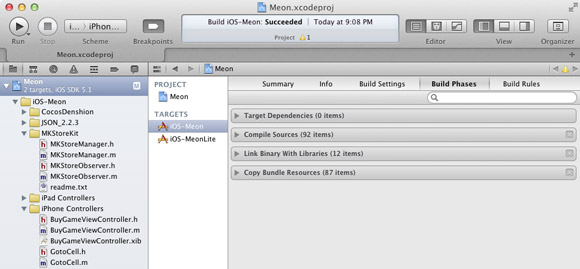
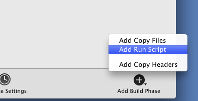
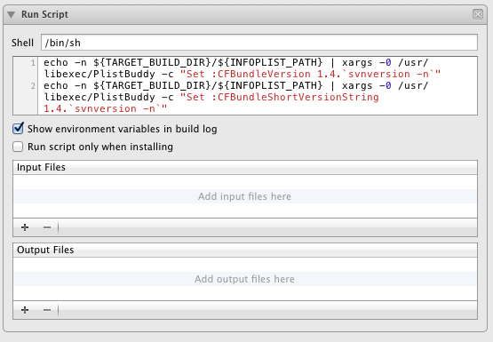
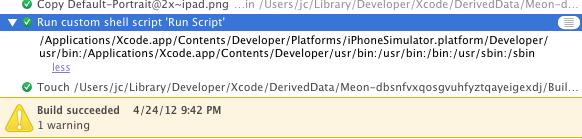

## Xcode 4 vs Me : Running Custom Scripts after Build

### The easy way

Sometimes, you need to run some custom scripts after each build of your app with Xcode. For instance, I set the version strings of my apps (aka `CFBundleVersion` and `CFBundleShortVersionString`) to my working repository svn revision. I can then uniquely identify apps binaries and quickly see which modifications in my source code introduce weird bug.

Adding a custom build phase that will run a script is very easy in Xcode 4:

1. In the Project Navigator, select your Project
2. Select the Target on which you want to add a build script
3. Select 'Build Phases' tab    

4. Click on 'Add Build Phase' button in the lower right corner and select 'Add Run Script'   

5. In the script window, type your own script or drag a script file over it

To set the svn version on the app version, I use the following script:

	echo -n ${TARGET_BUILD_DIR}/${INFOPLIST_PATH} | xargs -0 /usr/libexec/PlistBuddy -c "Set :CFBundleVersion 1.4.`svnversion -n`"
	echo -n ${TARGET_BUILD_DIR}/${INFOPLIST_PATH} | xargs -0 /usr/libexec/PlistBuddy -c "Set :CFBundleShortVersionString 1.4.`svnversion -n`" 
	
This script puts the svn revision number, i.e. 1769M, as a minor build identifier. That's way, my app version will be 1.4.1769M (if you don't know it yet, `PlistBuddy` is your friend when you want to deal with plist files). 

You can use this technique to run various script after your builds, like do some automated tests etc...

### The hard way

Problems begin to arise when you want to invoke some nonstandard tool in your script (like `convert` from [ImageMagick](http://www.imagemagick.org/)). 

You can hardcode the path to this binary in your custom script but maybe you're using [Homebrew](http://mxcl.github.com/homebrew/) as I do and someone in your team is using [MacPorts](http://www.macports.org/). In this case, you don't want to hardcode the path to the binaries but you want Xcode to use the right command in the right path.

The problem is that scripts invoked by Xcode don’t read any of the usual shell configuration files (.profile, .bash_profile, .cshrc, /etc/paths ...), so Xcode won't be able to find your tools. If you echo `$PATH` at the beginning of the script, you will see

	
	/Applications/Xcode.app/Contents/Developer/Platforms/iPhoneSimulator.platform/Developer/usr/bin:/Applications/Xcode.app/Contents/Developer/usr/bin:/usr/bin:/bin:/usr/sbin:/sbin 
	
Xcode customize `$PATH` with the following directories:

- `/Applications/Xcode.app/Contents/Developer/Platforms/iPhoneSimulator.platform/Developer/usr/bin`
- `/Applications/Xcode.app/Contents/Developer/usr/bin`
- `/usr/bin`
- `/usr/sbin`
- `/sbin`

no matter how you've configured `$PATH` in the standard way.

The solution is to use an OSX special environment file: with `~/.MacOSX/environment.plist` you can add environment variables so that Cocoa application can retrieve these variables at launch. In this [Apple Technical Q&A](http://developer.apple.com/library/mac/#qa/qa1067/_index.html), you can see how to construct this file.

Simply follow this steps:

1. Create a `.MacOSX` folder inside your home directory `mkdir ~/.MacOSX`
2. Type in a Terminal `defaults write $HOME/.MacOSX/environment PATH "/usr/local/bin:/usr/bin:/bin:/usr/sbin:/sbin:/usr/X11/bin"`. Don't forget to change the value of the `PATH` variable with your configuration. As I use [Homebrew](http://mxcl.github.com/homebrew/), `/usr/local/bin` is the first directory I'm interested in. This command will create the necessary plist, set the variable `PATH` to your list of binary directory
3. Logout your session, login and you can run Xcode and now you can use your non-standard tool in your custom scripts!

_A small warning_: if you're editing `environment.plist` with an external editor, insure that the plist is in binary format, otherwise it won't be taken into account by OSX (to convert the plist in binary, just type `plutil -convert binary1 environment.plist`).

### The Hell way  

Now, the crazy problems!

I want to use some svn tools as part as my build workflow (like `svnversion`). I want also to use the last version of svn, which is 1.7.4, and the version shipped with Xcode is 1.6.17. I don't know all the modifications of svn 1.7 over 1.6 but the only fact that there is now only one `.svn` folder at the root of your working directory (à la git..) is so cool...and convince me to switch.

As I'm using [Homebrew](http://mxcl.github.com/homebrew/), to get the last version of svn, I just type this in a Terminal :
	
	brew install svn
	
And boum! svn 1.7.4 is installed directly on my system, `in /usr/local/bin`.

But there is a big problem: in my custom build scripts, when I use some svn tools, Xcode keep using svn 1.6.17. The previous technique won't work because when updating `$PATH`, Xcode will put its own path first `/Applications/Xcode.app/Contents/Developer/Platforms/iPhoneSimulator.platform/Developer/usr/bin` before `/usr/local/bin` where the new svn is. In any case,  Xcode will use in priority the tools in `/Applications/Xcode.app/Contents/Developer/Platforms/iPhoneSimulator.platform/Developer/usr/bin`.

So to make Xcode 4 work with svn 1.7, the solution is to link your `/usr/local/bin/svn*` files to the path used by Xcode (solution via [Stack Overflow](http://stackoverflow.com/questions/8268505/xcode-error-build-failed-please-upgrade-your-subversion-client-to-use-thi), translated from <http://hxsdit.com/1484>):

1. First, create a backup directory of `/Applications/Xcode.app/Contents/Developer/usr/bin/svn*` files :
	- `cd /Applications/Xcode.app/Contents/Developer/usr/bin` 
	- `mkdir ~/Backupsvn/`
2. Move the svn tools used by Xcode
	- `sudo mv svn* ~/Backupsvn/`
3. Link you brand new svn to the path used by Xcode
	- `ln -s /usr/local/bin/svn* /Applications/Xcode.app/Contents/Developer/usr/bin/`
	
You can now use svn 1.7.4 in your custom script. __A big warning__: the source control command in Xcode and the Repositories in Organizer doesn't seem to work anymore . I've struggled to identify and solve the problem, and I haven't succeeded to connect to my svn server... Anyway, as I'm using svn with [Cornerstone](http://itunes.apple.com/app/cornerstone/id404789253?mt=12) and sometimes in command line, it' not a big deal for me.
	
From jc.