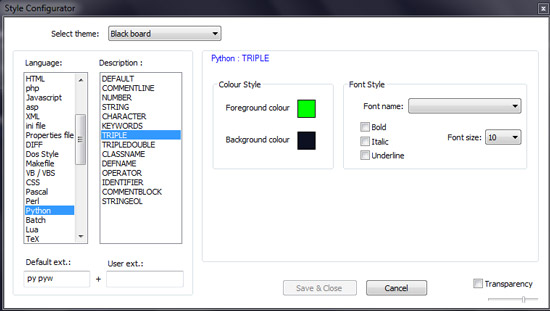
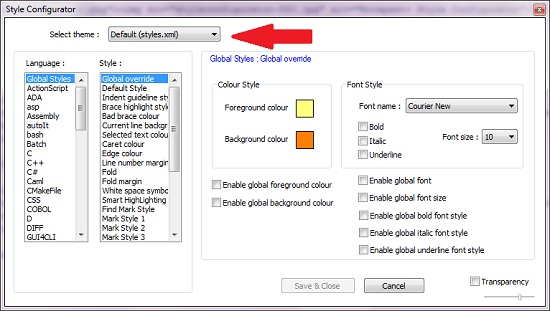
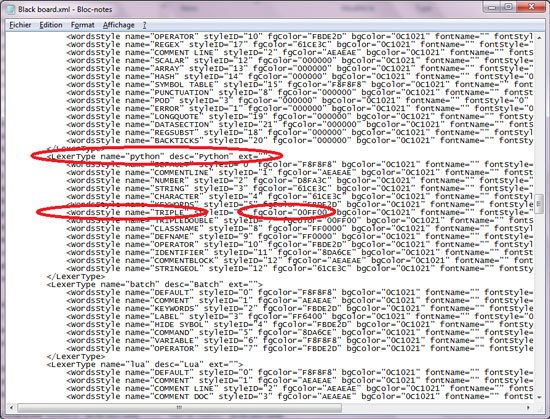

## Notepad++ : Cannot Save Color Highlighting Modification

Notepad version : 5.9.3

### The problem

In "Settings / Style configurator" menu, I want to modify a "colour style" :

- Let's say, as far as "Black board" theme is concerned, I would like to modify "Foreground colour" (which defaults to a kind of dark grey) to a beautiful green.
- I do it in the "Style Configurator" window, great !
- I close the program
- And when I reopen it, the configuration has gone !

### Some solutions

#### Modify default theme

- In "Settings / Style configurator" menu, be aware to select default style "Default (style.xml)"
- Choose a style you want to modify
- Restart Notepad++, that's it, the chosen color had been saved ! Actually default theme is saved without any trouble.

#### Hard modify specific theme configuration file

- You can modify the XML theme configuration file, located in "themes" folder
- Open "./themes/Black board.xml" file with notepad (the original one, as this file cannot be modified if you open it with notepad++ as it uses it !)
- Find the correct language and description section, then modify the fgColor or bgColor attribute to the RGB value you chose.
- Restart Notepad++, that's it, the chosen color had been saved !

From Paul.