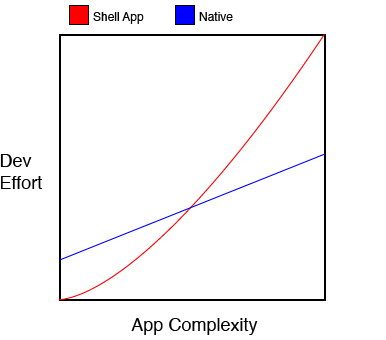

##  No Silver Bullets

<small class="caption">Courtesy of <a href="http://sandofsky.com/blog/shell-apps.html">Benjamin Sandosfky - Shell Apps and Silver Bullets</a></small>

From [Benjamin Sandofsky](http://sandofsky.com/), 
[Shell Apps and Silver Bullets](http://sandofsky.com/blog/shell-apps.html) is a must read piece on why developing native is always better than developing “shell apps” (ie a thin native wrapper around a web app). This article is so so good that it's hard to pick only one quote. Maybe this one is my favorite:

> Shells apps promise to let you share a single implementation across several 
> platforms. In practice, they trade several straightforward implementations for
> a single complex implementation.

Benjamin raises the following issues with shell app:

1. __The Framework Tax__ or how PhoneGap and others bridge framework will always be behind the native features. 
2. __Browser Fragmentation__ HTML5 on Windows Phone is not the HTML5 on Android is not the HTML5 on iOS
3. __Versioning__ (maybe the least convincing bullet)
4. __The Uncanny Valley__ native apps are _consistent_ to their platform. 
5. __Performance__ I'm still waiting to see a web app that perfoms as good as a native app.

And the myths that explained why companies keep trying to build shell apps:

- “We Need to Release Faster”
- “Write Once, Run Anywhere”
- “HTML 5 is easier”

I would add a fourth: “It Will Cost Less”. At the end of the day, if you count the time you spend dealing with your open source framework, the browser fragmentation, the time you will spend to mimic the native OS etc... I'm sure that developing and maintaining one shell app that works flawless on iOS and Android is more expensive that developing and maintaining an iOS and an Android version.

Benjamin sums up so well what I'm thinking: if you want the best “app experience”, go to the native language/framework of your platform. And frankly, who doesn't want to have the best product?

A last one:

> Web technology is great for many things. Replicating a native app experience
> is not one of them.

So good article.

From jc.

