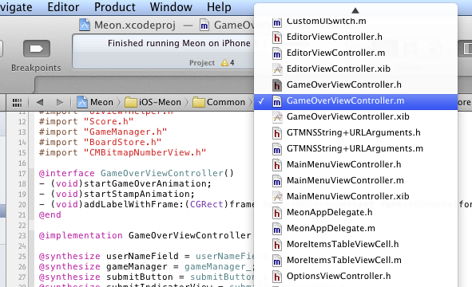

## Xcode Tips #2 - Quickly Navigate in Your Code

With this tip, you won't use your mouse anymore while coding!

If you want to quickly navigate in your Xcode 4 project _only with your keyboard_:

1. __Jump to a particular file__: type __crtl+5__, this will pop up a 'Show Group Files' menu. Now, directly type the file of the name you want to open (or even part of it), and files are filtered to match your query (the filter is not case sensitive). Type enter, boom!, you open the file.    
    
then    

2. __Jump to a particular function (okay...selector)__: in your file, type __ctrl+6__ and then type the selector you want to target. You can even reach your beloved `#pragma mark -`: for instance, typing 'subviews' will match `#pragma mark - subviews managment` in this particular case. 

_A side note_: french developers who use french keyboard will maybe need to remap some of these keyboard shortcuts to more convenient ones (for instance,  __ctrl+(__ for finding files). To do this, 'Xcode > Preferences > Key Bindings'.

Big time saver!

From jc.