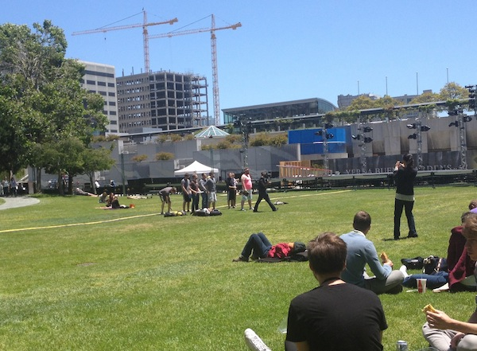

## Preparing for John Siracusa's Review of OS X Mountain Lion Soon!

Remember the [preparing for John Siracusa's Review of OS X Lion](http://www.youtube.com/watch?v=nhOG25fM8so) by [Pat Dryburgh]( http://patdryburgh.com)?

<iframe width="560" height="315" src="http://www.youtube.com/embed/nhOG25fM8so" frameborder="0" allowfullscreen></iframe>

Well, be prepared for the sequel:

The shots have taken place at Yerba Buena Gardens, near the Moscone center during the WWDC 2012. This team of geeks looks like having a lot of fun!

From jc.