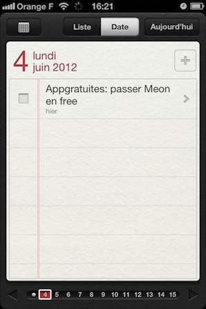

## Of Splash Screens and iOS Apps

> If you think that following these guidelines will result in a plain, boring 
> launch image, you’re right. Remember, the launch image is not meant to provide
> an opportunity for artistic expression; it is solely intended to enhance the
> user’s perception of your app as quick to launch and immediately ready for
> use. The following examples show you how plain a launch image can be.

<a href="http://developer.apple.com/library/ios/#documentation/UserExperience/Conceptual/MobileHIG/Introduction/Introduction.html">Apple iOS Human Interface Guidelines</a>

When you're developing an app on a platform, one of the most important rule is [to respect the UI conventions of the platform](http://blog.manbolo.com/2011/12/23/respect-the-platform). For example, on iPad, an app is expected to run in all orientations (with the exception of some games); on iPhone/iPad, a Star icon is associated to 'Favorite' and a plus icon is associated to an 'Add' action. 

That's why I'm sad each time I see a splash screen in an iOS app. Because, on iOS, _none app should have a splash screen_. 

Apple recommends in the [iOS Human Interface Guidelines](http://developer.apple.com/library/ios/#documentation/UserExperience/Conceptual/MobileHIG/Introduction/Introduction.html) to provide a __placeholder UI__ that will be replaced by the real UI as soon as the app is ready. The idea is to give user the impression to __start instantly__:   

> __Display a launch image that closely resembles the first screen of the 
> application__. This practice decreases the perceived launch time of your 
> application.
>
> __Avoid displaying an About window or a splash screen__. In general, try to 
> avoid providing any type of startup experience that prevents people from using
> your application immediately.

If you look at Apple apps, you can see the difference between the splash screen of the app (on the left) and the first screen of the app:

<small class="clear">Caculator</small>

<small class="clear">Clock</small>

<small class="clear">Game Center</small>

<small class="clear">Reminder</small>

<small class="clear">Calendar</small>

<small class="clear">Compass</small>

<small class="clear">Garageband</small>

<small class="clear">iPhoto</small>

<small class="clear">Recorder</small>

<small class="clear">Stock</small>

And some from third parties apps:

<small class="clear">Twitter</small>

<small class="clear">Chomp</small>

<small class="clear">CalcBot</small>

<small class="clear">5by5</small>

As you can see, the idea is really to create the splash screen as if the first page of the app doesn't have any content. You should also hide all the labels. You (or you marketing guy) may think that your branding is less strong. You can be even ask to add a real splash screen and delay it to N seconds so the user can really see your beautiful artwork. Please, defend yourself and argue that people spends no more than a minute or two evaluating a new app, and you have to make the most of this brief period by presenting useful content immediately.

Apple advices for creating a splash screen (or __Launch Images__ as Apple refers to it) are: 

> To enhance the user’s experience at application launch, you must provide at
> least one launch image. A launch image looks very similar to the first screen
> your application displays. iOS displays this image instantly when the user
> starts your application and until the app is fully ready to use. As soon as
> your app is ready for use, your app displays its first screen, replacing the
> launch placeholder image.    
> Supply a launch image to improve user experience.
> Avoid using your launch image as an opportunity to provide:
>
> - An “application entry experience,” such as a splash screen
> - An About window
> - Branding elements, unless they are a static part of your application’s first
> screen
>
> Because users are likely to switch among applications frequently, you should
> make every effort to cut launch time to a minimum, and you should design a
> launch image that downplays the experience rather than drawing attention to
> it.

### Games are Games

All the previous talk is perfect for “classic” apps but games are particular kind of apps. Because you want your game to be engaging and immersive, you will want to have a splash screen, with a super movie etc.. That's say, I still believe that these guidelines on splash screens still apply here: the quicker you can play, the better it is.  

From jc.