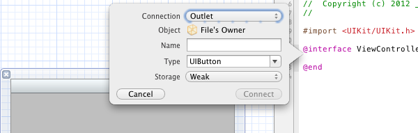
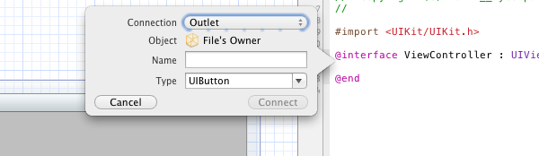

## Outlet Management on Cocoa Touch

Outlet management used to be different on Cocoa Touch and on Cocoa. In pre-iOS 5 times, outlets were implemented in Apple samples and guidelines using:

1. `property` declaration
2. `retain` memory management

On iOS, typical declaration of an outlet used to be:

	@interface MyViewController{
		UILabel *_myLabel;
	}
	@property (nonatomic, retain) IBOutlet UILabel myLabel;

On contrary, on (Mac)OSX, a typical implementation used to be:

	@interface MyViewController{
		IBOutlet UILabel *_myLabel;
	}

[Jeff LaMarche](http://iphonedevelopment.blogspot.com/) wrote two interesting posts on this matter [Outlet - Property vs. Instance Variable](http://iphonedevelopment.blogspot.com/2008/12/outlets-property-vs-instance-variable.html) and [Outlet, Cocoa vs. Cocoa Touch](http://iphonedevelopment.blogspot.com/2010/10/outlets-cocoa-vs-cocoa-touch.html): in the latter one, Jeff recommended, against the Apple guidelines, to use `assign` instead of `retain` with outlet. His argument was that the way the nib and outlet are memory managed on OSX should be a good model also for iOS, leading <q>less typing and less code to maintain</q>.  

Well, all these happens before iOS 5 and the introduction of ARC.

Jeff wrote this post in September 2010, and this was like a premonition of ARC, and the changement that ARC would introduce in the outlet memory management. 

Now, if you're using ARC (and you should use it now), you have to use weak (assigned) outlet instead of retained. In [Your First iOS App](https://developer.apple.com/library/ios/referencelibrary/GettingStarted/RoadMapiOS/JumpRightIn/iPhone101/Articles/00_Introduction.html#//apple_ref/doc/uid/TP40011343-TP40007514) (the Apple guide for iOS beginners), configuring an IBOutlet leads to this declaration:

	@property (weak, nonatomic) IBOutlet UITextField *textField;
	
With ARC, outlet are now property declared, and weak; in [Resource Programming
Guide](https://developer.apple.com/library/ios/#documentation/Cocoa/Conceptual/LoadingResources/Introduction/Introduction.html#//apple_ref/doc/uid/10000051i-CH1-SW1), Apple recommendations are:

> From a practical perspective, in iOS and OS X outlets should be defined as
> declared properties. Outlets should generally be weak, except for those from
> File’s Owner to top-level objects in a nib file (or, in iOS, a storyboard
> scene) which should be strong. Outlets that you create should will therefore
> typically be weak by default, because:
>
> - Outlets that you create to, for example, subviews of a view controller’s
> view or a window controller’s
> window, are arbitrary references between objects that do not imply ownership.
> - The strong outlets are frequently specified by framework classes (for 
> example, UIViewController’s view outlet, or NSWindowController’s window
> outlet).

In Xcode 4.3.3, adding an IBOutlet with Interface Builder in an ARC enabled project create a `weak` reference

Whereas, if you are not using ARC in your project, Xcode will not propose you the type of outlet, but will create a retain/release outlet:

In short, if you're using ARC, use weak outlets. That's very good change because:

- the way to declare outlet is now the same on iOS/OSX.
- you should type less

Obviously, Objective-C is changing, and I think in a good way: less typing, and uniformisation of the iOS/OSX model. Writing this article make me think that I miss Jeff LaMarche voice and blog posts. I'm sure that he has very good reason not to blog more but I miss his technical and always very detailed articles.

From jc.

