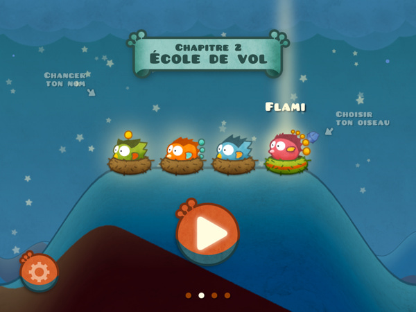
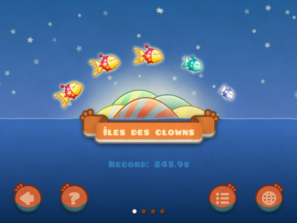
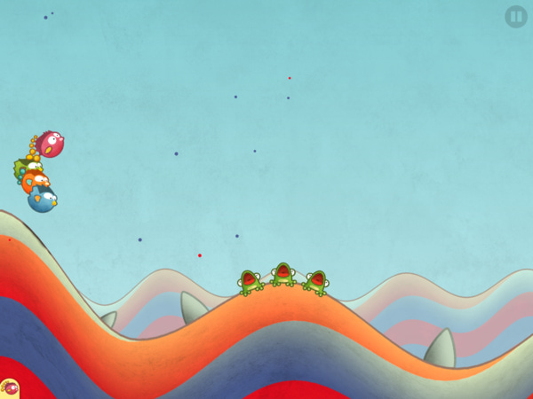
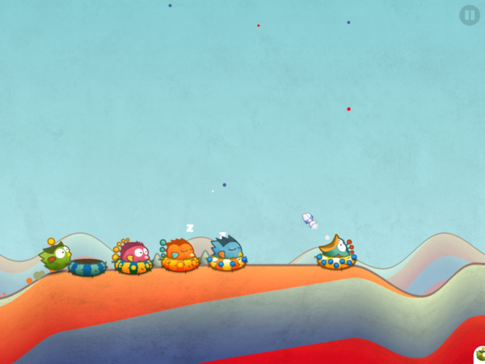
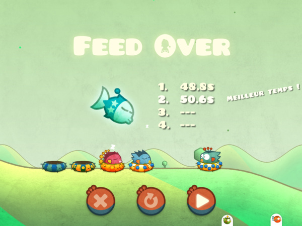
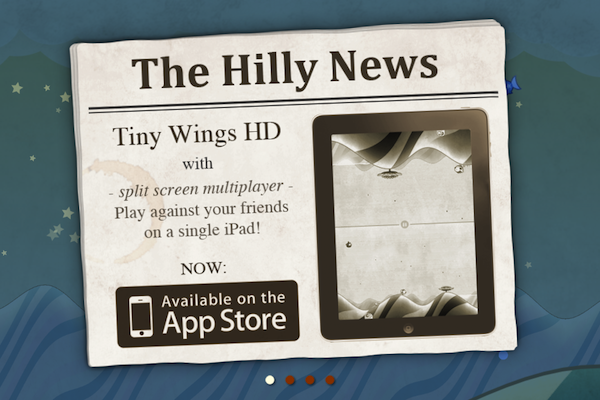
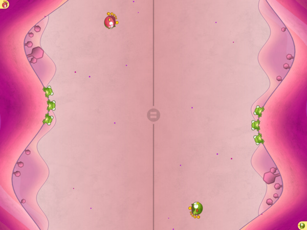
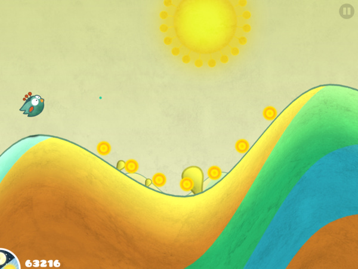
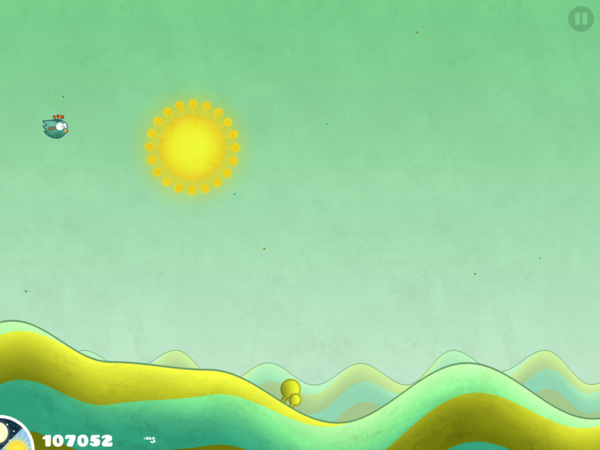
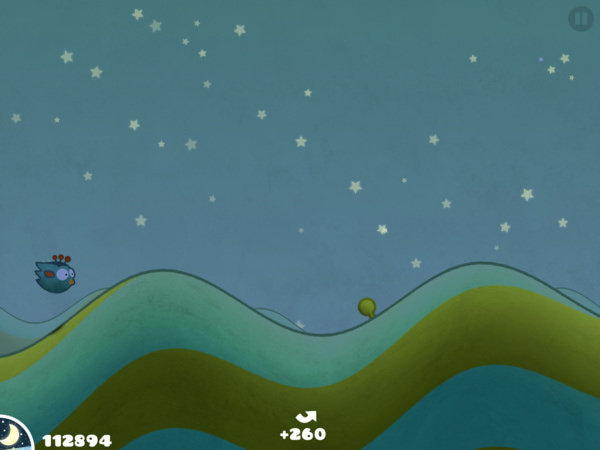

## Tiny Wings 2

<a href="http://itunes.apple.com/us/app/tiny-wings/id417817520?mt=8"></a>

### Finally!

Remember the [Tiny games of the year 2011](http://blog.manbolo.com/2011/12/14/tiny-games-of-the-year)? Well, [Tiny Wings](http://itunes.apple.com/app/tiny-wings/id417817520?mt=8) has been updated: the v2.0 is improved with Retina graphics, there is a new race mode (where you can compete against 4 others cute birds), and performances are even better (in the previous version, there was an imperceptible delay when you flight over a new island, but this delay is not here anymore). The game is gorgeous, Retina graphics are really cute and superb, the attention to detail from the __only__ developer [Andreas Illiger](http://www.andreasilliger.com/) is impressive.

And there is more: [Tiny Wings](http://itunes.apple.com/app/tiny-wings-hd/id541517597?mt=8) is finally coming to iPad, with also a Retina treatment. Graphics look terrific and the fluidity is perfect. You can even play against a friend on the same iPad... 
   
I've captured some screenshots but they don't show the pixel-perfection and the polish _- in every screen -_ of this app.

Only one default: the game is not universal, so if you want to benefit from the superb iPad version, you'll have to pay some bucks again.

I __love__ this game.
 
### A new mode: Tiny race!

### Face to face

### Classic game, always good, feel quick

From jc.