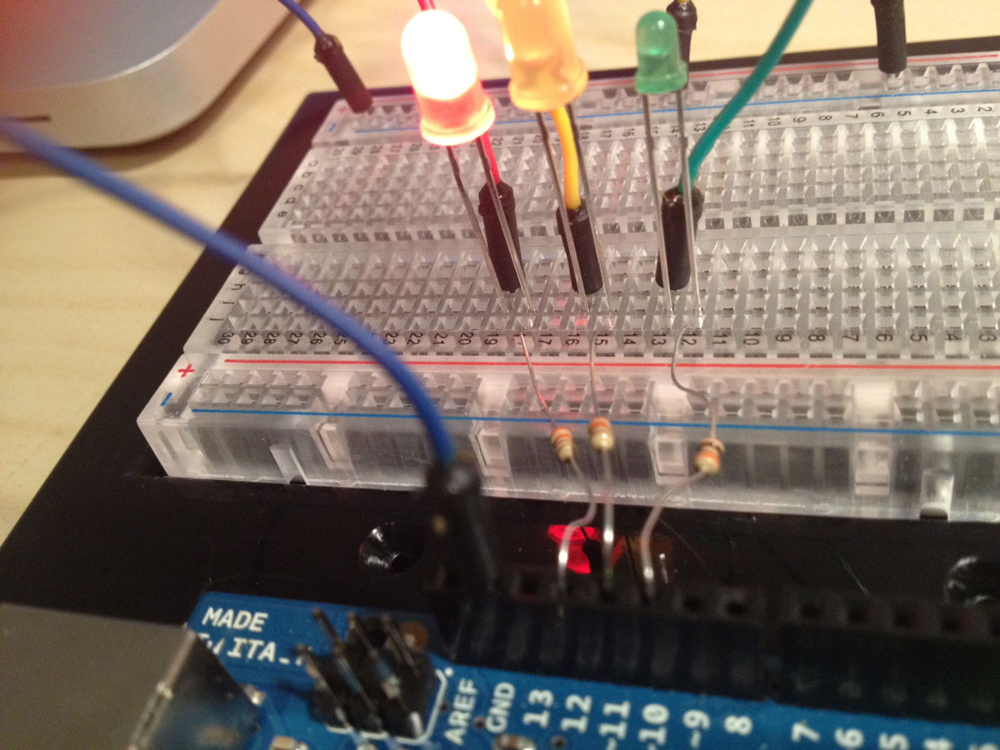

## Electronics for Dummy iPhone Developers

Waouh. I've always been intimated by electronics: software development seems so easy, you just need a computer and you can do what you want, whereas with electronics you have wires, resistors, voltage, electrons...

But [Electronics for iPhone Developers Tutorial: Create an Arduino Traffic Light!](http://www.raywenderlich.com/19781/electronics-for-iphone-developers-tutorial-create-an-arduino-traffic-light), by [Dani Arnaout]( http://www.raywenderlich.com/about#daniarnaout) has definitively demystified electronics.

Read the article, check out the video, and I'm sure you'll right away buy an 
[Arduino](http://www.arduino.cc/) to play. I'm definitively looking forward the next article where we should learn how to control the Arduino with an iPhone.

Ray and his iOS Tutorial Team [propose very good tutorials](http://www.raywenderlich.com/tutorials) on iOS development ([ARC](http://www.raywenderlich.com/5677/beginning-arc-in-ios-5-part-1), [OpenGL ES 2.0](http://www.raywenderlich.com/3664/opengl-es-2-0-for-iphone-tutorial), [Core Data](http://www.raywenderlich.com/934/core-data-tutorial-getting-started) etc...) but this one is going to be one of my favorites.

From jc.