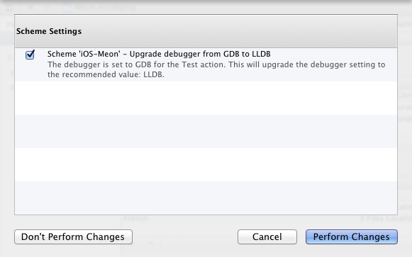

## When Xcode 4 Keep Asking Upgrading Your Project

One of the best feature of Xcode 4 is the project upgrade: when Xcode detects that some of your project settings are out dated, it proposes you to perform necessary changes to keep your project up to date.

In a time of big changes under the cover (switch from `GCC` to `LLVM`, raise of `ARC` etc..), this feature is very welcomed to keep your settings up to date and delete the deprecated options.

When it works...

Recently, Xcode warns me that some of my project settings need an upgrade:

	The debugger is set to GDB for the Test action. This will upgrade the debugger settings to the recommended value: LLDB. 

I clicked on 'Perform Changes', Xcode confirmed that the changes has been effective, but each time I reopened the project, Xcode keep asking me to upgrade the same setting on the Action scheme, again and again.
 
Force Xcode to really do the upgrade is easy:

1. Quit Xcode.
2. Localize your xcodeproj, for instance `~/Documents/Dev/Meon/Meon.xcodeproj`
3. Open the xcodeproj bundle, you should see a `xcuserdata` folder, open it
4. You should see a folder named `my_user.xcuserdatad`. This folder contains configuration files for the project scheme, for the debugger (like breakpoint etc..). If breakpoints make sense user per user (each user has obviously a different set of breakpoints), scheme settings per user is very awkward because you usually want to have scheme settings to be shared between all the project developers. Anyway, as Xcode says there is a problem in the Action scheme, open the `xcschemes` folder.
5. In the `xcschemes` folder, you should have some .xcscheme file. .xcscheme file are simply XML configuration file.
6. Open the .xcscheme file, and try to edit parameters that need to be updated: in my case, I simply replaced all occurrences of `Xcode.DebuggerFoundation.Debugger.GDB` with `Xcode.DebuggerFoundation.Debugger.LLDB`.
7. Open Xcode, open your project, Xcode should be happy now!

From jc.