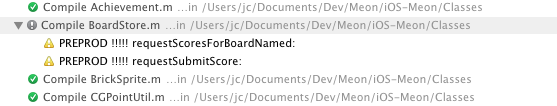
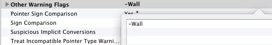

## Warnings in Xcode

[Mark Dalrymple](http://borkware.com/), in [A Bit on Warnings](http://weblog.bignerdranch.com/798-a-bit-on-warnings/):
> Nothing makes me more depressed than joining a project where every build emits
> a stream of warnings. “Oh, you can ignore those” or “Yeah, we’re going to get
> around to fixing that.” And then I check the subversion log and see the
> warnings been in there for a year.
>
> I think that’s a huge mistake. Warnings should either be fixed (they are
> showing a legitimate problem) or suppressed (we “know” this is OK, stop 
> bugging me).

I love having a clean projet that build without any warning. I think the main point raised by Mark is that too many warnings will hide the very important one that you don't want to miss. For instance, in our code, we're using `#warning` pragma directive to output important warning: when we build [Meon](http://itunes.apple.com/app/meon/id400274934?mt=8), we only have warnings that are raised by these directives `#warning PREPROD !!!!! requestScoresForBoardNamed:` and that tell us that the build is using pre-production servers. 

When we want to submit an app to the App Store, our build log have to be clean, without any warning.

Now, I use more and more `-Wall` in our projects and try to fix every warning. This is a really good habit and, I think, will allow our code to stay up-to-date.

### How to Enable Warning flag in Xcode

You can do it very simply, on a case by case, in your project. You can use [this list of warnings](http://boredzo.org/blog/archives/2009-11-07/warnings) by Peter Hosey. 

Open your Xcode project, click on the `xcodeproj`, open the 'Build Settings' flag and go to 'Apple LLVM compiler 4.0 - Warnings - All languages' 

Each item correspond to a `GCC_WARN_*`compiler warning flag: for instance, 'Hidden Local Variables' will activate `GCC_WARN_SHADOW` in your build, that you can activate or deactivate.

If you want to simply enable `-Wall` ([see here](http://gcc.gnu.org/onlinedocs/gcc/Warning-Options.html) for the detailed explanation of flags activated by `-Wall`), you can use the 'Other Warning Flags' and add `-Wall` for a given configuration.

### For the intrepid ones

Xcode 4.4 has added a `-Weverything` flag that check even more code and constructions than `-Wall`. Yes, as the name doesn't imply, `-Wall` doesn't check all! You can try `-Weverything` in your projet and see what means _everything_... 

From jc.

