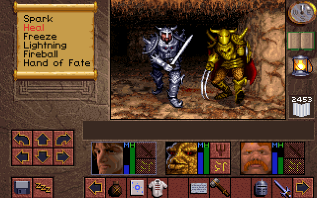

## Play Your Beloved Abandonwares on OSX with Boxer

__Updated on 2012/09/19:__ [Really nice review](http://arstechnica.com/gaming/2012/09/boxer-review-retro-gaming-on-the-mac-done-right/
) of Boxer by [Ars Technica](http://arstechnica.com/). The conclusion:
> __The Good__    
> Beautiful interface    
> Near-universal game support    
> Painless MT-32 emulation lets you rediscover new things in old games    
> Supernal example of OS X's “it just works” design philosophy    
>
> __The Bad__    
> The ability to force certain display modes (like “always use CGA”) would be
> nice for uber-retro gaming    
> Couldn't quite figure out how to make Gravis Ultrasound support work with the
> titles I had available to test    
>
> __The Ugly__    
> The only thing ugly about this app is not using it!    

* * * * *

Well, those kids don't know the _real_ games: [Lands of Lore](http://en.wikipedia.org/wiki/Lands_of_Lore:_The_Throne_of_Chaos), [Ultima VII](http://en.wikipedia.org/wiki/Ultima_VII:_The_Black_Gate), [Gabriel Knight](http://en.wikipedia.org/wiki/Gabriel_Knight), [Monkey Island](http://en.wikipedia.org/wiki/The_Secret_of_Monkey_Island) etc... You can play easily to these gems with the venerable [DOSBox](http://www.dosbox.com), but there is a much better alternative on OSX for you guys: __[Boxer](http://boxerapp.com)__!

Boxer is built on DOSBox, is totally free, and seamlessly integrated in OSX. You can play to the best games of the 80s and 90s, all the great blockbusters that you can find on <http://www.abandonware-france.org> for instance.

Don't hesitate, and grab it now!

> Avatar. You, too, shall soon acknowledge my authority - for I shall be your
> companion... your provider... and your master!

From jc.

