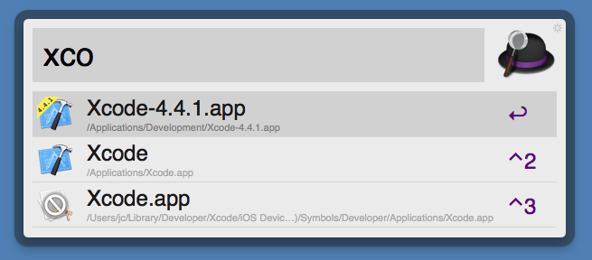

## Xcode 4.5 and 4.4.1 Cohabitation

If you want to support the new iPhone 5, and adapt your app to the 640x1136 screen, you must use the just-released Xcode 4.5. The problem is that Xcode 4.5 dropps the support for `armv6` devices (i.e. iPhone 3G), and OS versions inferior to iOS 4.3. Using Xcode 4.5, you can't build apps that can be deployed on iOS 4.0 for instance: as usual,  Apple is very pushy to support new devices and versions.  

Unfortunately, you may need to support, for a short transitional period, an app that requires iOS 4.2 or lower. Or you want to update a version that still work on iPhone 3G. The simpler solution is to keep two versions of Xcode: the latest (Xcode 4.5 for the moment) and the last to support “old” devices (Xcode 4.4.1).

Now that Xcode is sandboxed, you can easily have two versions on your system. For instance, I have the latest installed in `/Applications/Xcode.app/` and the 4.4.1 in `/Applications/Development/Xcode-4.4.1.app/`. If you want to easily differentiate the two versions, you can download [my custom Xcode 4.4.1 icon](/2012/09/24/Xcode.icns) and copy it under `/Applications/Developement/Xcode-4.4.1.app/Contents/Resources/` (change with your Xcode 4.4.1 path).

Now, when you launch Xcode, with [Alfred](http://www.alfredapp.com) for instance, you will see this:

 
If you haven't kept Xcode 4.4.1, [you can still download it here](https://developer.apple.com/downloads/index.action?name=Xcode) (with other older versions).

From jc.