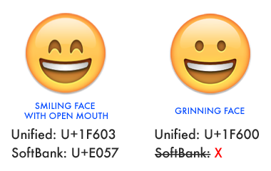
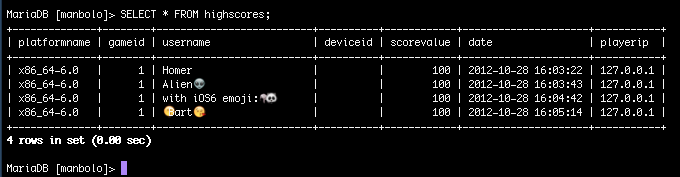
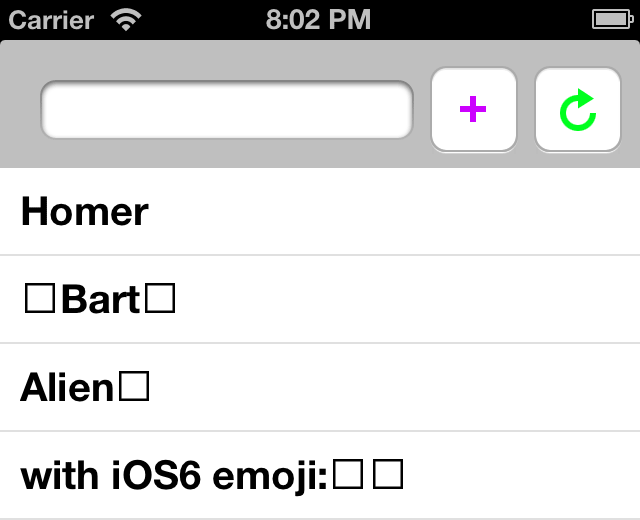
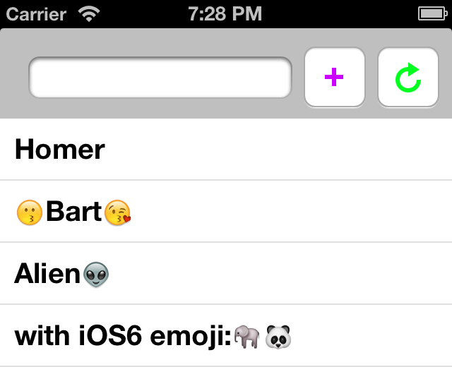

## Supporting New Emojis on iOS 6

### A bit of context

__In iOS 4 and previous version__, Apple was using a SoftBank mapping to encode [emojis](http://en.wikipedia.org/wiki/Emoji): all the iOS 4 emojis were encoded using UTF-8, on 3 bytes. For instance,  was coded with the unicode character `U+E057`. That was fine, 
because MySQL 5.x versions implements “classic” UTF-8 with a maximum width of three bytes (before introducing other encoding like `utf8mb4`).
 
__In iOS 5__, Apple switched the SoftBank emojis encoding to a Unified encoding, a common proposition between various company like Apple, Google and so on. With this unified encoding, all the emojis used UTF-8 4-bytes characters. There was even a Unicode data file, [EmojiSources.txt](http://www.unicode.org/Public/UNIDATA/EmojiSources.txt), defining mapping from and to Japanese vendors' legacy character sets like SoftBank, DoCoMo and KDDI. For instance, , used to be coded with `U+E057` (3 bytes), now was coded with `U+1F603` (4 bytes).   
In Meon, we have a bug in our highscores web service: our MySQL database was using “classic” UTF-8, meaning that all the new 4-bytes emojis were truncated to 3-bytes, and usernames that used emojis weren’t displayed properly. [How we've corrected this bug was described here](http://blog.manbolo.com/2011/12/12/supporting-ios-5-new-emoji-encoding), but long story short, we used [this piece of code](https://github.com/iamcal/php-emoji) on the server side to detect  and convert, on fly, 4-bytes Unified emojis to 3-bytes SoftBank emojis. Fine, bug closed!

__In iOS 6__, Apple has added more emojis in the OS. These emojis are defined in the Unicode standard, but for almost all these new emojis, there is no 3-bytes SoftBank equivalent. So, our iOS 5 patch isn't able to detect and convert these emojis, because there is no conversion possible at all!!   

-  code name `SMILING FACE WITH OPEN MOUTH`, available since the beginning, is coded on iOS 4 with `U+E057` (SoftBank), and with `U+1F603` (Unified) on iOS 5 and iOS 6.
-  code name `GRINNING FACE`, newly available on iOS 6, is coded using `U+1F600`, _with no SoftBank equivalent_. 

So, to deal with these new emojis in our highscores in any iOS version (iOS 4, iOS 5 and iOS 6), we have to find a much better solution!

### The Right way: upgrade our database to support multibyte Unicode

In newer versions of MySQL, a new encoding,`utf8mb4`, was introduced to properly support all the 4-bytes Unicode characters. To deal with these 4-bytes emojis, the right thing to do is to update our MySQL database to properly support multibyte Unicode, by using `utf8mb4` instead of `utf8`. To do this, I've simply followed [this very detailed post blog](http://mathiasbynens.be/notes/mysql-utf8mb4) by [Mathias Bynens](http://twitter.com/mathias). The following steps are a sum-up of  [Mathias Bynens](http://twitter.com/mathias)'s post, so I strongly encourage you  to see the full article for better explanations. 

#### 1. Switching from MySQL’s `utf8` to `utf8mb4`

First, we’ve changed the character set and collation properties of the database, tables, and columns, to use `utf8mb4`, instead of `utf8`.

	# For each database:
	ALTER DATABASE database_name CHARACTER SET = utf8mb4 COLLATE utf8mb4_unicode_ci;
	# For each table:
	ALTER TABLE table_name CONVERT TO CHARACTER SET utf8mb4 COLLATE utf8mb4_unicode_ci;
	# For each column:
	ALTER TABLE table_name CHANGE column_name column_name VARCHAR(191) CHARACTER SET utf8mb4 COLLATE utf8mb4_unicode_ci;
	# (Don’t blindly copy-paste this! The exact statement depends on the column type, maximum length, and other properties. The above line is just an example for a `VARCHAR` column.)

#### 2. Modify the server application code to use the right character sets

In our server application code, we set the connection character set to `utf8mb4`. Usually, you should simply replace `utf8` by `utf8mb4`. For instance, our highscores web service is written in PHP so

	$db->exec("SET NAMES 'utf8' COLLATE 'utf8_unicode_ci';");

becomes:

	$db->exec("SET NAMES 'utf8mb4' COLLATE 'utf8mb4_unicode_ci';");

where `$db` is a classic [PDO object](http://www.php.net/manual/en/book.pdo.php).

#### 3. Check client and character sets

In our `/etc/my.cnf` config file, we set the following instructions:

	[client]
	default-character-set = utf8mb4

	[mysql]
	default-character-set = utf8mb4

	[mysqld]
	character-set-client-handshake = FALSE
	character-set-server = utf8mb4
	collation-server = utf8mb4_unicode_ci

A simple check to insure the configuration is correct:

	MariaDB> SHOW VARIABLES WHERE Variable_name LIKE 'character\_set\_%' OR Variable_name LIKE 'collation%';
	+--------------------------+--------------------+
	| Variable_name            | Value              |
	+--------------------------+--------------------+
	| character_set_client     | utf8mb4            |
	| character_set_connection | utf8mb4            |
	| character_set_database   | utf8mb4            |
	| character_set_filesystem | binary             |
	| character_set_results    | utf8mb4            |
	| character_set_server     | utf8mb4            |
	| character_set_system     | utf8               |
	| collation_connection     | utf8mb4_unicode_ci |
	| collation_database       | utf8mb4_unicode_ci |
	| collation_server         | utf8mb4_unicode_ci |
	+--------------------------+--------------------+
	10 rows in set (0.01 sec)

#### 4. Finally repair and optimize all tables

Either with some MySQL queries:

	# For each table
	REPAIR TABLE table_name;
	OPTIMIZE TABLE table_name;
	
Or using command-line:

	$ mysqlcheck -u root -p --auto-repair --optimize --all-databases
	
### Don’t forget JSON is built-in in iOS 5

Now that our database seemed ok, we’ve inserted some datas and checked that everything is ok. We were feeding the database with usernames containing emojis and ran a simple queries to check the result:

	MariaDB [manbolo]> SELECT * FROM highscores;

And the output:

On the database, everything seemed to be well configured now; and, using the terminal under Mountain Lion, we could even see the emojis in the table!

Then we tested some usernames containing emojis, with an iOS test app to display some highscores... and... unfortunately, the usernames didn’t displayed well in the iOS client...

<small class="caption">Bad highscores display in our test app</small>

However, looking at the data coming from the backend, the highscores were returned in JSON:

	{
	"index":"0",
	"list":
		[{
			"username":"Homer",
			"scorevalue":"100",
			"date":"2012-10-28 16:03:22"
		},
		{
			"username":"\ud83d\ude17Bart\ud83d\ude18",
			"scorevalue":"100",
			"date":"2012-10-28 16:05:14"
		},
		{
			"username":"Alien\ud83d\udc7d",
			"scorevalue":"100","date":"2012-10-28 16:03:43"
		},
		{
			"username":"with iOS6 emoji:\ud83d\udc18\ud83d\udc3c",
			"scorevalue":"100",
			"date":"2012-10-28 16:04:42"
		}
	]
	} 

But wait, what are those weird `\u` charaters? The 3rd highscore for instance, with the username Alien, is coded in the returned JSON like this: `Alien\ud83d\udc7d`. In the MySQL database, the data looks fine, but our webservice returns the emojis with this double escaping. Our webservice is written in PHP, and we are using the built-in [`json_encode`](http://php.net/manual/en/function.json-encode.php) to send the datas. Looking at the [JSON RFC](http://www.ietf.org/rfc/rfc4627.txt) (the end of the 2.5 Strings section), the escaping in the output is correct (but not mandatory): 

> To escape an extended character that is not in the Basic Multilingual Plane, 
> the character is represented as a twelve-character sequence, encoding the
> UTF-16 surrogate pair.  So, for example, a string containing only the G clef 
> character (U+1D11E) may be represented as "\uD834\uDD1E". 

While not mandatory (you can put directly emoji UTF-8 character without escaping in the JSON), the PHP JSON encoder prefers to escape it. On the app side, we use [SBJson](https://github.com/stig/json-framework) from [Stig Brautaset](http://twitter.com/stigbra). The library seems not to support well this “twelve-character sequence”, maybe because we have a too old version of the framework. Instead of getting and testing the latest version of SBJSON, we simply switch to the [built-in JSON serialization APIs `NSJSONSerialization`](http://developer.apple.com/library/ios/#documentation/Foundation/Reference/NSJSONSerialization_Class/Reference/Reference.html), available from iOS 5, and suddenly...

<small class="caption">Good highscores display in our test app</small>

### Finally

_Really_ supporting emojis was not an easy road:

1. On the server side, upgrade our MySQL to use `utf8mb4` encoding
2. On the app side, use the iOS built-in JSON encoder/decoder

But now, we have a stronger fondation for supporting all the new emojis that will be added in the future !

From jc. 

