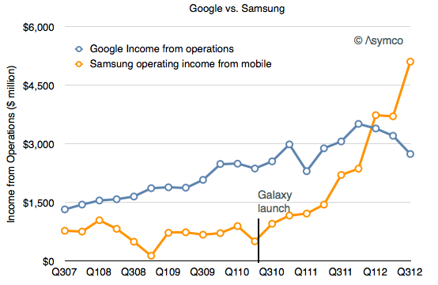

## Google vs Samsung by Horace Dediu

> What would happen if Samsung soaks up so much profit from mobile that it’s in 
> a position to acquire Google and control the trajectory of their enabling plat
> form?

Impressive perspective on [Google vs. Samsung][] by [Horace Dediu][]. Horace excells in the art of extracting information from raw datas. When you see this graph:

You can effectively ask yourself what if Samsung buy Google?

From jc.

[Google vs. Samsung]: http://www.asymco.com/2012/11/14/google-vs-samsung/
[Horace Dediu]: http://www.asymco.com/

