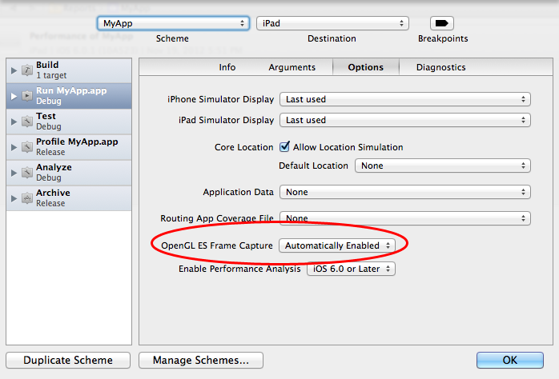
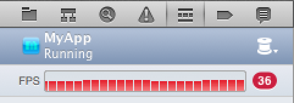
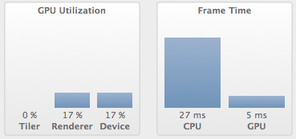

## Using Xcode OpenGL ES Frame Capture

![Xcode OpenGL ES Frame Capture][]

Having used Microsoft Visual Studio a while ago, I think that the real difference with Xcode is that Xcode comes with a full suite of performance tools _for free_. [Instruments][] is the most obvious one, but since version 4.5, Xcode includes a facility for capturing and analysing OpenGL ES frames. This tool, called OpenGL ES Frame Capture, is really simple and powerful: you can log all the OpenGL calls for a frame, inspects the content of OpenGL buffers, sees your OpenGL ES 2.0 shaders (even the “hidden” ones used by `GLKBaseEffect`). This is a quick review about how to use it in your app. 

To follow this review and test a sample code, you can use one of the excellent [Ray Wenderlich][] OpenGL/GLKit tutorials like
[OpenGL ES 2.0 for iPhone Tutorial][] or [How To Create A Simple 2D iPhone Game with OpenGL ES 2.0 and GLKit][].

_Disclaimer_: I'm a completely OpenGL rookie so I might employ not the right terminology in the following post. That's said, let's go! 

### 1. How to setup OpenGL ES Frame Capture

There is a short [Apple documentation about OpenGL ES Frame Capture][]. To capture OpenGL frames, you'll need to use, at least, Xcode 4.5. __The capture can only be done on a real device, running at minimum iOS 5__, and connected to your Mac.

If you're already including GLKit or OpenGL framework in your code, your project is already set up for OpenGL frames capturing. Anyway, you can check it by going to Product > Manage Schemes..., double-click you app scheme, click on Edit....

Tap on the Run scheme, then Options tab and check that 'OpenGL ES Frame Capture' is set to Automatically Enabled or Enabled.

### 2. Capturing a Frame

You can capture a frame while you're debugging your app. Launch the app in Debug mode (Product > Run or &#8984;R). Once the app is launched, display the Debug Navigator (View > Navigators > Show Debug Navigator), and click on the FPS section of the Debug Navigator.

You can watch the FPS updated while playing with your app and test different use cases. Your mission, if you accept it, is to maintain a good 60 FPS. On my app sample, I'm currently running at 36 FPS so I will need to find where the performance bottleneck is.

In the editor, you can see the time spent in the CPU and the GPU. If you want to achieve 60 FPS, you basically have 16 ms to update and render each frame. In my app, I'm spending 27 ms in the CPU and only 5 ms in the GPU.

Given this number, I can already see that my problems are not on the GPU side, but maybe simply in my code. Let's capture a trace to have a better view of what's happening at each frame rendering. Just above the Debug console, tap on the Camera icon to capture an entire frame:

![Capture Frame icon][]

After clicking on the Capture frame icon (the capture take a few secons), you will have access in the Debug Navigator to the OpenGL frames:

![OpenGL frames overview][]

On the device, you can see that the captured frame is displayed and paused. In the Debug Navigator, if you expand the rendering icon , you will see all the OpenGL calls for the frame you've just captured. The Debug Navigator has a list of every draw call and state call associated with that frame (and your code call stack). The buffers associated with the frame are shown in the editor pane, and the state information is shown in the debug pane.

If you don't see the OpenGL objects pane (the blue one), just click on the assistant icon, and select in the power bar, for instance, All GL Objects:

![Assistant power bar][]

You can right click in the Buffer pane and select Show Draw Call Highlight to see a cute green triangle on the triangle drawn by the call:

![Draw boxes][]

### 3. Inspecting OpenGL objects

In the assistant, you have access to the OpenGL objects like the Vertex buffers, the Index buffers, the binded (or not binded) texture, the shaders programs:

![Objects panes][]

Click on the Index buffer will give you acces to the content of the buffer:

![Index buffer][]

Click on the Programs will show you the corresponding shaders source code:

![Shaders][]

It's a super simple and convenient way to get the source code of the shaders ”hidden” by `GLKBaseEffect`! 

### 4. Improving performances

Just watching at the OpenGL capture frame, one can see that there is a huge obvious performance improvement to be done. In my current app, I draw 200 planes sprites with their shadow. Each plane has it own texture so the pseudo code for this captured OpenGL frame is:

	glBindTexture( texture-plane-type-0) // texture for the plane of type 0
	glDrawArrays(GL_TRIANGLE_FAN, 0, 4) // draw 2 triangles (= 4 vertices in fan mode) for the sprite 

	glBindTexture( texture-plane-type-6)
	glDrawArrays(GL_TRIANGLE_FAN, 0, 4) 
	...
	...
	...
	...
	glBindTexture( texture-plane-type-2)
	glDrawArrays(GL_TRIANGLE_FAN, 0, 4) 

In the captured frame, there is practicality one render call for each sprite, resulting for more than 6000 OpenGL calls per frame! A very first optimisation is to have as few OpenGL calls as possible. In this case, instead of binding and rendering each planes one by one, I can use a [Texture atlas][] and sprite batching to just bind one texture and only one draw call for all the planes. The resulted pseudo code will be:

	glBindTexture( texture-atlas-for-planes) // texture for the plane of type 0
	glDrawElements(GL_TRIANGLE_FAN, 0, 200 * 3 * 2) // draw 200 * 6 vertices for all sprites 

After having modified the code and recaptured the frame, one can see that all the planes are rendered in only one call (the green boxes show the triangle rendered by the selected OpenGL code):

The app is now at a good 60 FPS ! Xcode gives you also some advices: in that case, there is still room to add more effect and quality:

![Improvement][]

### 5. Saving and sharing captured frames

One final thing: you can export and save your captured OpenGL frame. You can even share it with someones that don't have your source code, if you want an OpenGL expert to analyse your calls.

Doing this is a bit awkward, I've not found a better way to do this, but it works. Select an OpenGL call in the Debug Navigator, then right click on the Xcode title bar where you can see the frame capture file name (`*.gputrace`):

![Saving frame][] 

You can see where Xcode temporally store the `.gputrace` file; you can then save this file in your Documents. If you want to reopen or share this file with someone, just connect a device on your Mac, double-click on the `gputrace` file and you will see this dialog box:

![Importing][] 

Click on Replay trace and Xcode will launch in a self-contained mode with just this file. Very convenient!

From jc.

[Xcode OpenGL ES Frame Capture]: screen1-mini.png
[Instruments]:  http://developer.apple.com/library/mac/#documentation/DeveloperTools/Conceptual/InstrumentsUserGuide/Introduction/Introduction.html
[Ray Wenderlich]: http://www.raywenderlich.com/about
[OpenGL ES 2.0 for iPhone Tutorial]: http://www.raywenderlich.com/3664/opengl-es-2-0-for-iphone-tutorial
[How To Create A Simple 2D iPhone Game with OpenGL ES 2.0 and GLKit]: http://www.raywenderlich.com/9743/how-to-create-a-simple-2d-iphone-game-with-opengl-es-2-0-and-glkit-part-1
[Apple documentation about OpenGL ES Frame Capture]: http://developer.apple.com/library/ios/#documentation/ToolsLanguages/Conceptual/Xcode4UserGuide/060-Debug_Your_App/debug_app.html
[Capture Frame icon]: capture-icon.png
[OpenGL frames overview]: frames.png
[Assistant power bar]: assistant.png
[Draw boxes]: bbox.png
[Objects panes]: objects-pane.png
[Index buffer]: indexbuffer.png
[Shaders]: shaders.png
[Texture atlas]: http://en.wikipedia.org/wiki/Texture_atlas
[Improvement]: screen7.png
[Saving frame]: screen8.png 
[Importing]: importing.png 

