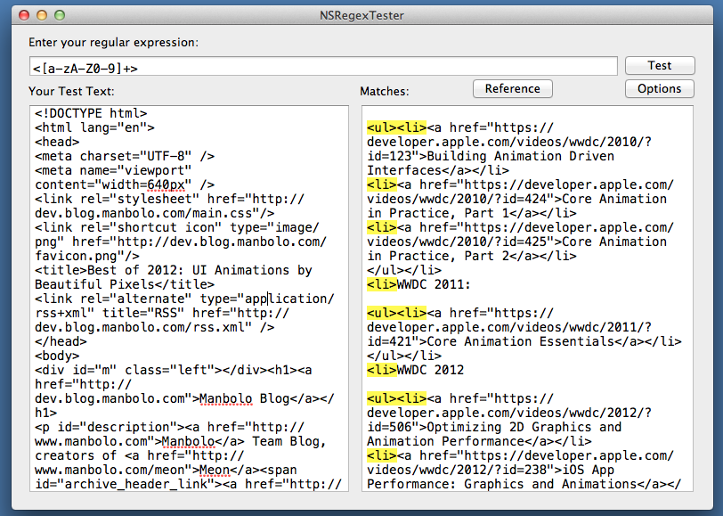

## NSRegexTester: a Simple OSX App to Test Regular Expression

[NSRegexTester][] by [Aaron Vegh][]

> This is a very simple Mac OS X application that allows you to test regular
> expressions against sample text. It is based on the Mac OS SDK's
> implementation of NSRegularExpression, which is based on ICU.

Hyper simple and hyper useful. You can get the source code [on GitHub][]. You can even have acces to a quick regular expression reference sheet.

![NSRegexTester Reference][]
 
From jc.

[Aaron Vegh]: http://aaron.vegh.ca
[on GitHub]: https://github.com/aaronvegh/nsregextester
[NSRegexTester Screenshot]: app.png
[NSRegexTester]:http://aaron.vegh.ca/2013/01/announcing-nsregextester/
[NSRegexTester Reference]: reference.png