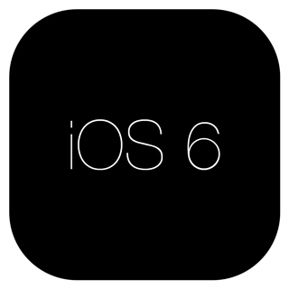

## New Metrics for iOS 7 App Icons

__Updated on 2013/12/19:__ the beta version of iOS 7.1 seems to have restored the iOS 6 maximum number of characters for app icon. Check your app name on the beta before trying to find a new name (hello [Photodiscover][])!

* * * * *

There are some change in the icon metrics for iOS 7 that are worth noted.

### Number of characters in app icon name

_TLTR: the shorter your app display name is, the better it is._

The default police and text rendering have slightly changed on iOS 7. As a consequence, the display name of your app on the homescreen is affected and the maximum number of characters before your icon label is truncated has changed.

For instance, take an app called 'Lorem Ipsumd'. On iOS 6 (left image), the app label is __'Lorem Ipsumd'__ but, on iOS 7 (right image), this label is truncated and displayed as __'Lorem Ipsu...'__:

![lorem ispum ios6 ios7][]

If the maximum number of characters was around 13 characters on iOS 6, this number is now around 12 characters, and __you should be really safe with 11 characters__ (for western name and depending of your label of course). Some apps will have to be updated, like my favorite Photo browsing app, [Photodiscover][] (13 characters!).

Some things to note:

- If you have a space in your app name, and if this name is truncated now on iOS 7, you can try to replace the regular space by a thinner space. To do this, you can use the Character Viewer. Open Characters Viewer in your menu bar (if you don't have Character Viewer in the menu bar, go to System Preferences > KeyBoard and select 'Show Keyboard & Character Viewers in menu bar'). Once Character Viewer is opened, type 'space' in the search field, you will be able to select different spaces and insert them in your `CFBundleDisplayName`. For instance, 'SIX-PER_EM SPACE' is a thinner space than the regular one and can be used to fit your app name on the homescreen.    
![Character Viewer][]
- Apple build-in apps can by-pass this limit! For instance, in French, “Camera” is displayed “Appareil photo”. If your own app is called “Appareil photo”, no matter space-trick you will use, your app name will be truncated. In fact, even if you remove the space and call your app “Appareilphoto”, your app name will be truncated. Sneaky Apple...    
![Camera icon][]
- Name that are truncated on iPhone may be not truncated on iPad. The maximum number of characters before being truncated is larger on iPad. If your app is universal, you can use `CFBundleDisplayName~ipad` in your `Info.plist` to have a different name on iPad (thanks [Hamish Moffatt][] for having pointed to this).
- Apps that have been just downloaded but not opened have now a little blue circle in front of their icon display name. So, just after the download of the app, your app name may also be truncated until the user open your app for the first time. (I understand the rational behind the new UI - no localization, same metaphor as unread mail, flatter design - but, come-on, the iOS 6 ruban was much nicer and so cute!)
![New app][]   

### Icon shape

The classic rounded rect shape icon has also changed on iOS 7. As of iOS beta 6, the current shape is: 

<svg version="1.1" id="Ebene_1" xmlns="http://www.w3.org/2000/svg" xmlns:xlink="http://www.w3.org/1999/xlink" x="0px" y="0px"
		 width="320px" height="320px" viewBox="0 0 320 320" enable-background="new 0 0 320 320"
					  xml:space="preserve">
<title>Rounded Corners</title>
<path d="M113.184891,10.000000L206.815109,10.000000C236.526733,10.000000,251.382538,10.000000,267.374176,15.056519C284.834381,21.411518,298.588470,35.165600,304.943481,52.625816C310.000000,68.617462,310.000000,83.473274,310.000000,113.184891L310.000000,206.815109C310.000000,236.526733,310.000000,251.382538,304.943481,267.374176C298.588470,284.834412,284.834412,298.588470,267.374176,304.943481C251.382538,310.000000,236.526733,310.000000,206.815109,310.000000L113.184891,310.000000C83.473274,310.000000,68.617462,310.000000,52.625832,304.943481C35.165611,298.588470,21.411524,284.834412,15.056521,267.374176C10.000000,251.382538,10.000000,236.526733,10.000000,206.815109L10.000000,113.184891C10.000000,83.473274,10.000000,68.617462,15.056520,52.625832C21.411522,35.165607,35.165611,21.411518,52.625835,15.056519C68.617462,10.000000,83.473274,10.000000,113.184891,10.000000L113.184891,10.000000"/>
</svg>

<small>if you see a bunch of XML, your browser doesn't support HTML 5 inline SVG!</small>

You should definitively read [Exploring iOS 7 Rounded Corners][] from [Manfred Schwind][] for a brilliant and deep analyse of the new shape. The graphics resources (SVG and GIF) are all copied from this blog post so check it out. [Manfred][] has produced a GIF to emphasise the small differences of the new shape:

From [Exploring iOS 7 Rounded Corners][], you can [download a SVG version][] of this shape to use in your favorite graphics editor. 

Another very useful resource is a [Photoshop Script for iOS 7 Rounded Rectangles][] by [Mike Swanson][] that will allow you to create all different iOS7 icon sizes very easily in Photoshop. 

### Icon dimension

App icon sizes have changed and are now:

<table class="table-centered" style="width:100%">
<tbody>
<tr>
	<th>Devices</th>
	<th>iOS 6 size (in pixel)</th>
	<th>iOS 7 size (in pixel)</th>
</tr>
<tr>
	<td>iPhone Non Retina</td>
    <td>57 x 57</td>
    <td><b>not available</b></td>
</tr>
<tr>
	<td>iPhone Retina</td>
    <td>114 x 114</td>
    <td><b>120 x 120</b></td>
</tr>
<tr>
	<td>iPad Non Retina (mini and 2nd gen)</td>
    <td>72 x 72</td>
    <td><b>76 x 76</b></td>
</tr>
<tr>
	<td>iPad Retina</td>
    <td>144 x 144</td>
    <td><b>152 x 152</b></td>
</tr>
</tbody>
</table>

If you want to target only iOS 7, you just need 76 x 76, 120 x 120 and 152 x 152 icon sizes. If you want to target also iOS 6, you'll need 57 x 57, 72 x 72, 76 x 76, 114 x 114, 120 x 120, 144 x 144 and 152 x 152 icon sizes. Without counting Spotlight and Settings icon if you don't want the OS to interpolate them!

### Having a different icon on iOS 6 and iOS 7 

If you app look is radically different on iOS 6 and iOS7, maybe you want to have a different icon on iOS 6 and iOS 7. Due to the icon dimension change, you can make an iOS 6 icon with a 114 x 114 size and an iOS 7 icon with a 120 x 120 size. Then, in your `Info.plist` file, add these two resources in the `CFBundleIconFiles` key:

	<key>CFBundleIconFiles</key>
	<array>
		<string>blue-114.png</string>
		<string>green-120.png</string>
	</array>

On iOS 6, you will have a blue icon, and on iOS 7, you will have a green icon. Simple!

### App submission failed because icons are missing

Be careful to provide all the icons you need otherwise your app will not pass Apple validation. If you've received this kind of email:

> Invalid Image - For iOS applications, icons included in the binary submission
> must be in the PNG format.
>
> -If your application supports the iPhone device family, you must include
> square icons of the following dimensions: 57x57 pixels and 120x120 pixels.
>
> -If your application supports the iPad device family, you must include square
> icons of the following dimensions: 72x72 pixels, 76x76 pixels and 152x152
> pixels

it's because of this. Double check your `Info.plist` file and also that the icon files you've referenced are in your app target. 

For instance, your `CFBundleIconFiles` key in the `Info.plist` file for an universal app supporting iOS 7 and iOS 6 should be:

	<key>CFBundleIconFiles</key>
	<array>
		<string>icon29.png</string>
		<string>icon29@2x.png</string>
		<string>icon57.png</string>
		<string>icon57@2x.png</string>
		<string>icon60@2x.png</string>
		<string>icon72.png</string>
		<string>icon76.png</string>
		<string>icon76@2x.png</string>
	</array>

And the `Info.plist` should be displayed like this:

![infoplist][] 

You can use whatever name you want, provided you're using all the mandatory sizes.

With Xcode 5, you can also have a nice overview in clicking on your project in the project navigator, click on the 'General' tab and check the 'App Icons' category. You should see something like this, without any yellow warning sign:

![xcode5][]

 
### Gloss effects have been killed

If your app icon was using the iOS glossy effect, you'll have to update your icon. `UIPrerenderedIcon` key (also known as “Icon already includes gloss effect”) has no effect on iOS 7. Appart from the rounded mask, your icon is rendered with no modification on iOS 7. If you still want a gloss effect on iOS 7, you just have to embed it in your icon resources.

From jc.

[lorem ispum ios6 ios7]: lorem-ios6-ios7.png
[Character Viewer]: CharacterViewer.png
[Camera icon]: camera.png
[Exploring iOS 7 Rounded Corners]: http://www.mani.de/backstage/?p=483
[Manfred Schwind]: https://twitter.com/manide
[Manfred]: https://twitter.com/manide
[download a SVG version]: http://mani.de/download/iOS%207%20App%20Icon%20Radius27@120.svg
[Photodiscover]: https://itunes.apple.com/us/app/photo-discover/id446635942?mt=8
[New app]: meon.png
[infoplist]: infoplist.png
[xcode5]: xcode5.png
[Photoshop Script for iOS 7 Rounded Rectangles]: http://blog.mikeswanson.com/post/61651302736/photoshop-script-for-ios-7-rounded-rectangles
[Mike Swanson]: https://twitter.com/Anyware
[Hamish Moffatt]: https://twitter.com/hmoffatt
