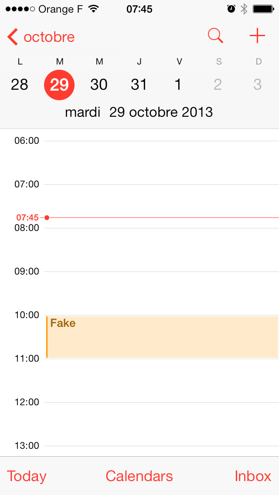

## Consistent vs Uniform

When I installed few days ago the iOS 7 revamp version of [Apple podcast app][], it made me remember how much I dislike the iOS 7 new design. From the first version of iPhone OS to iOS 6, I believe one of the key strength of the platform was achieving a __consistency__ in the UI, while having some freedom with color, textures, animations etc... The transitions between views were strongly coherent from apps to apps, buttons were instantaneously recognisable as tappable element, interactions were or intuitive either easily learnable, always enjoyable. With every developer/designer gaining experience, apps become a field of UI innovation, while remaining coherent and consistent.  

With [iOS 7 new design principles][], I feel this consistency has become too strong, and now we have __uniformity__.
 
Quoting [Matt Gemmell's iOS 7 first impressions][]

> Breathable whitespace is everywhere, and is used to unify and homogenise
> previously disparate interface styles

Here is a batch of (not randomly choosen) iOS 7 Apple and third parties apps screenshots. Yes the interface is homogeneous. In fact, __everything is white__! Everything is dull, identical, uniform.

In a word, _boring_.

<small class="clear">New iOS 7 version of Podcast app</small>
    

<small class="clear">Mail and Calendar</small>

<small class="clear">Contacts</small>

<small class="clear">Music and Notes</small>

<small class="clear">Alarm and Maps</small>

<small class="clear">Phone and Game Center</small>

This white plague has also spread through third parties apps:

<small class="clear">Tweetbot and Nike</small>

<small class="clear">Kickstarter and Ted</small>

Frankly, I miss the days were differences between apps were not limited to [some tint color][], or bold font. 

Of course, we are just at the beginning of a new area, designers and developers need to learn the new UI paradigms and invent new designs. But, I'm already fed-up with this white, flat minimalism: if you're updating your app for iOS 7, at least don't go with the stock white appearance like a tons of others apps.  

Frankly, do you think Apple is going to wait this time 6 years before introducing a new radical change?

From jc.

[Apple podcast app]: https://itunes.apple.com/en/app/podcasts/id525463029?mt=8
[iOS 7 new design principles]: https://developer.apple.com/library/ios/documentation/userexperience/conceptual/mobilehig/
[Matt Gemmell's iOS 7 first impressions]: http://mattgemmell.com/2013/06/12/ios-7/
[some tint color]: https://developer.apple.com/library/ios/documentation/userexperience/conceptual/transitionguide/AppearanceCustomization.html